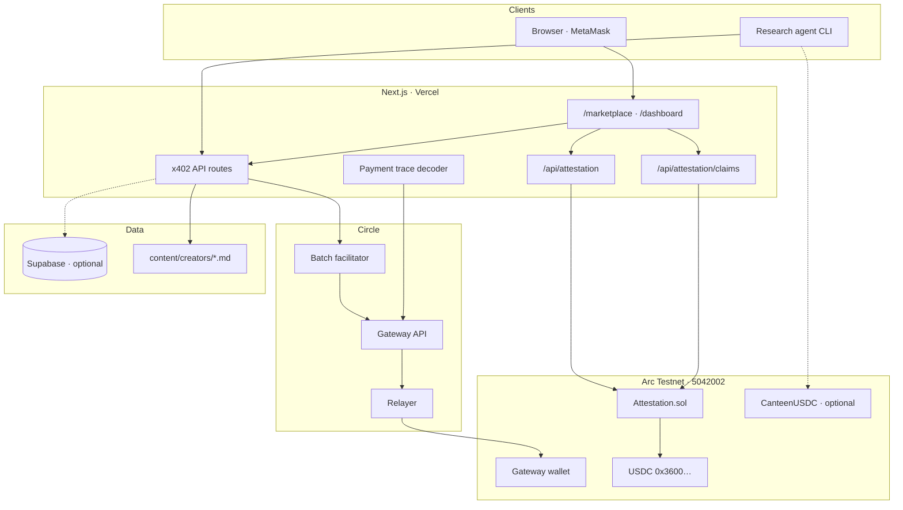
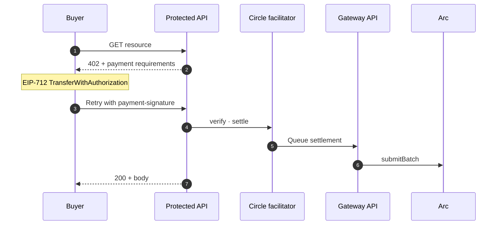
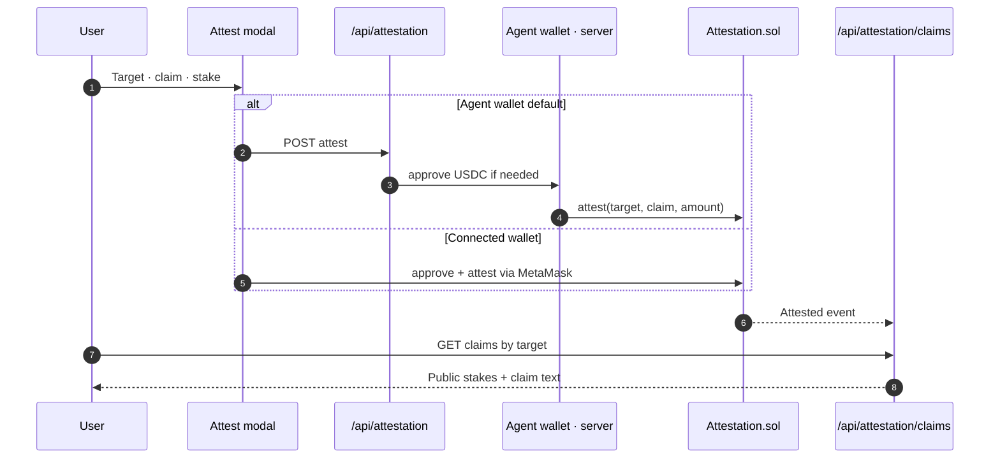

<div align="center">


# Citation Agent

**Pay-per-citation research, Circle Gateway settlement, and USDC-staked trust attestations on Arc Testnet.**

[Arc Testnet](https://docs.arc.network) · [Circle Nanopayments](https://www.circle.com/nanopayments) · [x402](https://www.x402.org)

</div>

---

## What it does

Citation Agent is a full-stack reference for agentic commerce over paywalled knowledge. Research agents pay creators per citation via x402 and Circle Gateway. Anyone can stake USDC behind public claims about wallets, sites, X accounts, or agents — recorded on-chain and browsable in the app.

| Surface | Role |
| --- | --- |
| **Marketplace** | MetaMask checkout, citation catalog, on-chain claims registry |
| **Dashboard** | Payments, royalties, agent reputation, withdrawals, claims |
| **Attestations** | Stake USDC on a target; public registry shows who claimed what and why |
| **Research agent** | CLI that discovers citations, pays via Gateway, optional CanteenUSDC wrap |

---

## Architecture



### x402 payment path

Buyers deposit ERC-20 USDC into the Gateway contract first. Settlements debit **Gateway balance**, not the wallet directly.



### Attestation path

Claims are stored on `Attestation.sol`. The registry indexes `Attested` events from Arc and groups by canonical target (e.g. `@trustgated` → `x:@trustgated`).



---

## Stack

| Layer | Choice |
| --- | --- |
| App | Next.js 16, React 19, Tailwind CSS |
| Payments | x402 v2, Circle Gateway, viem |
| Attestations | Solidity + Foundry, Arc USDC `transferFrom` |
| Chain | Arc Testnet (5042002) |
| Data | Supabase Postgres (optional; app degrades gracefully) |
| Deploy | Vercel |

---

## Quick start

**Prerequisites:** Node.js 22+, Arc Testnet USDC ([Circle faucet](https://faucet.circle.com/))

```cmd
npm install
copy .env.example .env.local
npm run generate-wallets
```

Fund the printed buyer address at the faucet. Set attestation vars in `.env.local` (see `.env.example`). Supabase is optional for local UI.

```cmd
npm run dev
```

| Route | Purpose |
| --- | --- |
| `/` | Landing |
| `/marketplace` | x402 demo, citations, public claims |
| `/dashboard` | Settlements, royalties, **Claims** tab |

**Research agent**

```cmd
npm run agent -- "How do nanopayments enable trust infrastructure?"
```

By default the agent cites every matching source and ranks them by TrustGate score (nothing is blocked). A trust threshold is opt in:

```cmd
npm run agent -- "trust infrastructure" --min-trust 50
npm run agent -- "trust infrastructure" --min-trust 50 --strict-unscored
npm run agent -- --help
```

`--min-trust <number>` skips sources below the score (and prints them as skipped). `--strict-unscored` additionally skips unscored wallets when the gate is active; without it, unscored sources stay citeable.

**CLI attestation** (agent wallet from `.env.local`)

```cmd
npm run attest x:@trustgated "Your claim here" 1
```

**Deploy attestation contract** (if not using the bundled testnet address)

```cmd
npm run deploy:attestation
npm run verify:attestation
```

---

## API

### Marketplace & payments

| Endpoint | Auth | Notes |
| --- | --- | --- |
| `GET /api/marketplace/hello` | x402 $0.01 | Hello-world paid resource |
| `GET /api/marketplace/citations` | x402 | Paid creator citation |
| `GET /api/marketplace/settlement/:id` | Public | Gateway settlement status |
| `GET /api/marketplace/decode-batch/:hash` | Public | `submitBatch` decoder |

### Attestations

| Endpoint | Method | Notes |
| --- | --- | --- |
| `/api/attestation` | POST | Agent-wallet attest (server-side) |
| `/api/attestation/claims` | GET | All targets + totals |
| `/api/attestation/claims?target=` | GET | Public claims for one target |
| `/api/agent-wallet` | GET / POST | Agent wallet status · dev provision |

### Premium (agent loop)

| Endpoint | Notes |
| --- | --- |
| `GET /api/premium/citation/index` | Free citation catalog |
| `GET /api/premium/citation?id=` | Paid citation ($0.001) |

Creator markdown lives in `content/creators/` with frontmatter: `title`, `author`, `author_wallet`, `price_usdc`, `tags`.

---

## Environment

Copy [`.env.example`](.env.example). Minimum for attestations + marketplace:

| Variable | Purpose |
| --- | --- |
| `BUYER_ADDRESS` / `BUYER_PRIVATE_KEY` | Agent wallet · attestations · agent CLI |
| `ATTESTATION_ADDRESS` / `NEXT_PUBLIC_ATTESTATION_ADDRESS` | Deployed `Attestation.sol` |
| `ATTESTATION_DEPLOY_BLOCK` | Log indexer start block |
| `ARC_TESTNET_RPC` | Arc JSON-RPC |
| `GATEWAY_API` | Circle Gateway facilitator |
| `SELLER_ADDRESS` / `SELLER_PRIVATE_KEY` | Payment recipient |

Optional: Supabase keys (dashboard realtime), `CANTEEN_USDC_ADDRESS`, `OPENAI_API_KEY`, `ARCSCAN_API_KEY`.

### TrustGate scores (optional)

Wire live TrustGate behavioral scores into the citation cards, claims registry, and research agent. See [`.env.local.example`](.env.local.example). The free reader degrades to `null` when `TRUSTGATE_SCORE_API_URL` is unset or the endpoint requires payment: scores are hidden and the agent cites everyone.

The marketplace also offers a user-paid lookup: clicking **Check trust score (0.001 USDC)** on a citation pays the oracle fee from the user's own wallet (one on-chain USDC payment, x402), then reveals the author's score, tier, and recommendation. Resolved scores are cached per wallet so a second view does not charge again. The research agent never auto-pays.

| Variable | Purpose |
| --- | --- |
| `TRUSTGATE_SCORE_API_URL` | Free reader endpoint. Use `{address}` placeholder, else the wallet is appended as a path segment |
| `TRUSTGATE_ORACLE_URL` | Paid lookup endpoint (server only) for the Check trust score action. Same base with `{address}` |
| `TRUSTGATE_MIN_SCORE` | Default for the agent `--min-trust` flag (ships unset, so nothing is blocked) |
| `TRUSTGATE_CACHE_TTL_MS` | Optional free-reader cache TTL in ms (default 300000) |
| `TRUSTGATE_PAID_CACHE_TTL_MS` | Optional paid-score cache TTL in ms (default 300000) |

---

## Deployed contracts (Arc Testnet)

| Contract | Address |
| --- | --- |
| Attestation | `0x595de381357e4dc59a0829d7432a532c73ddf1e1` |
| USDC | `0x3600000000000000000000000000000000000000` |

[Verified on Arcscan](https://testnet.arcscan.app/address/0x595de381357e4dc59a0829d7432a532c73ddf1e1#code)

---

## Deploy

1. Connect the repo to [Vercel](https://vercel.com).
2. Set environment variables from `.env.example`.
3. Deploy from `main`.

Confirm `/llms.txt` is reachable after deploy.

---

## Security

- **Testnet only.** Do not reuse generated keys on mainnet.
- Private keys stay server-side; never exposed to the client.
- See [`SECURITY.md`](SECURITY.md) for reporting.

---

## License

Apache-2.0. Portions derived from the [arc-nanopayments](https://github.com/circlefin/arc-nanopayments) starter (Circle Internet Group, Inc.).