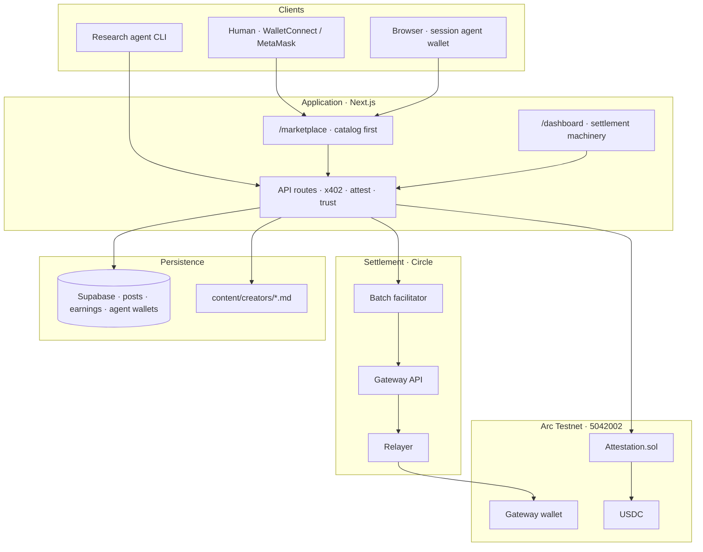
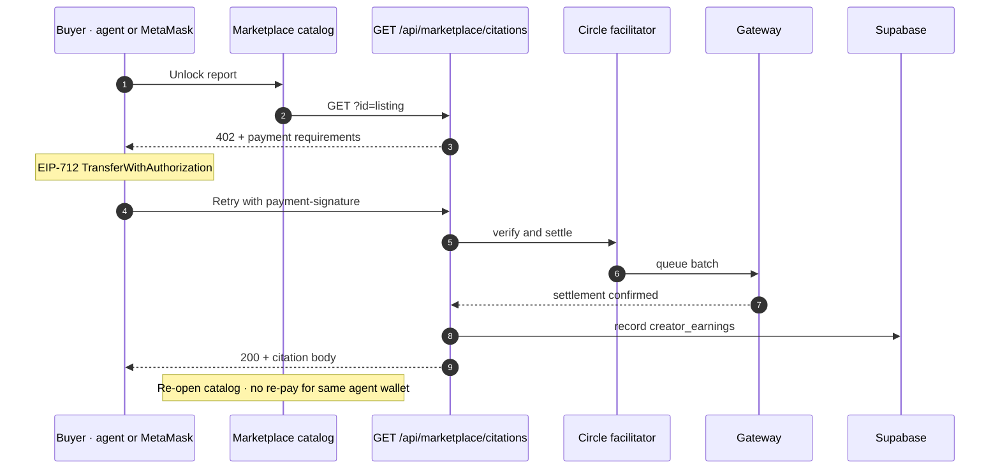
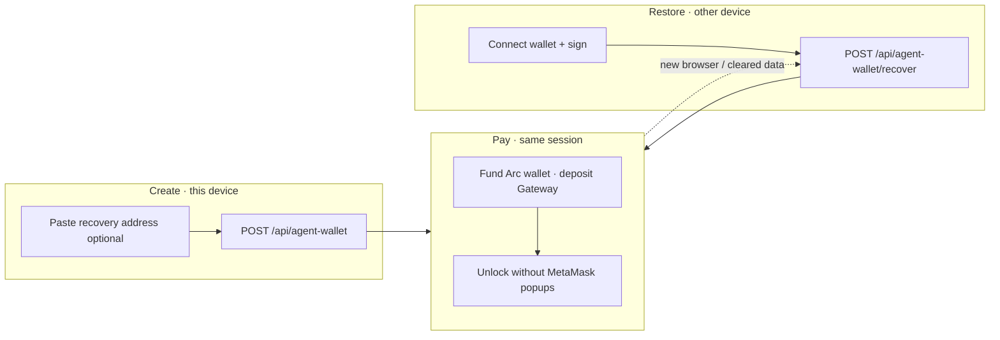
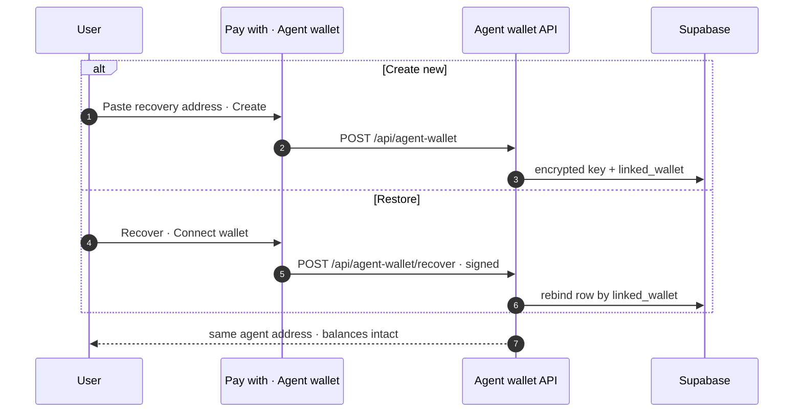
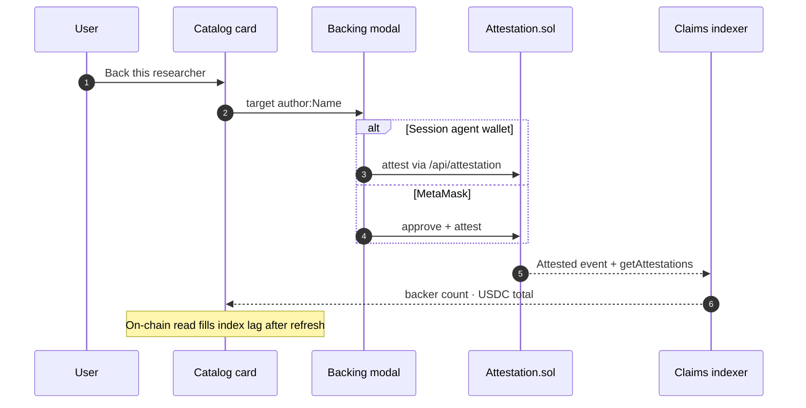

<div align="center">


# Citation Agent

**Researchers sell crypto research. Agents buy it.**

Paywalled research marketplace on Arc Testnet — x402 unlocks, optional reputation scoring, and on-chain research backing underneath.

[agentcitation.xyz](https://agentcitation.xyz) · [Arc Testnet](https://docs.arc.network) · [Circle Gateway](https://developers.circle.com) · [x402](https://www.x402.org)

</div>

---

## Overview

Citation Agent is a production-style reference for agentic commerce over paywalled knowledge. Analysts publish crypto research; humans and autonomous agents unlock reports with USDC via x402 and Circle Gateway. Settlement, reputation, and attestations are infrastructure — visible when needed, never the headline.

| Layer | What users see | What runs underneath |
| --- | --- | --- |
| **Catalog** | Browse, unlock, cite research | Markdown seeds + Supabase posts, catalog filter |
| **Commerce** | Per-report USDC unlock | x402 v2, Gateway batch settlement, royalty ledger |
| **Trust** | Optional score on cards | TrustGate arc-score (free) + paid verify (cached) |
| **Backing** | Stake behind a report or researcher | `Attestation.sol`, on-chain registry |
| **Agents** | CLI research loop · browser agent wallet | Session wallet, WalletConnect on mobile, sign restore on connect, Gateway pay |

Extended reference: [docs/platform-overview.md](docs/platform-overview.md)

---

## System architecture



---

## Research unlock flow

Buyers fund a **Gateway balance** first. Unlock debits that balance — not the wallet directly. Agent-wallet unlocks are remembered across refresh via `creator_earnings`; the same browser session also caches bodies in `sessionStorage`.



---

## Session agent wallet

Browser buyers use a **session agent wallet** — encrypted in Supabase, bound to an `agent_session` cookie (90-day max, 30-day rotation). Paste a recovery wallet address at **create** (no popup). On another device, click **Connect wallet** (WalletConnect on phone, MetaMask on desktop) and **sign** to restore the same wallet and Gateway balance. The wallet modal never opens on page load — only after you click Connect.





Setup UI: landing → choose Recover or Create → step 2. Re-tap **Agent wallet** to go back. Full reference: [docs/platform-overview.md](docs/platform-overview.md#session-agent-wallets).

---

## Research backing and reputation

Backing is framed as commerce copy on catalog cards (`Back this research` / `Back this researcher`). Stakes are public on-chain claims grouped by canonical target (`author:…`, `citation:…`). Reputation is optional per card — free badge when configured, paid verify when the user opts in.



---

## Stack

| Layer | Technology |
| --- | --- |
| Application | Next.js 16, React 19, Tailwind CSS, shadcn/ui |
| Payments | x402 v2, Circle Gateway, viem |
| Attestations | Solidity, Foundry, Arc USDC |
| Chain | Arc Testnet (5042002) |
| Data | Supabase Postgres (publish, royalties, agent wallets, paid trust cache) |
| Deploy | Vercel |

---

## Quick start

**Prerequisites:** Node.js 22+, Arc Testnet USDC ([Circle faucet](https://faucet.circle.com/))

```cmd
npm install
copy .env.example .env.local
npm run generate-wallets
```

Fund the buyer address from the faucet. Configure attestation and Supabase variables (see `.env.example` and `.env.local.example`). Apply migrations in `supabase/migrations/` — including `20260629100000_user_agent_wallet_linked_wallet.sql` and `20260629110000_user_agent_wallet_link_verified.sql` for agent wallet recovery.

```cmd
npm run dev
```

| Route | Purpose |
| --- | --- |
| `/` | Redirects to `/marketplace` |
| `/marketplace` | Research catalog, unlock, backing, reputation, infrastructure layers |
| `/dashboard` | Payments, royalties, withdrawals, operator fees, settlement trace |

**Research agent**

```cmd
npm run agent -- "Hyperliquid market structure"
npm run agent -- "stablecoin yield" --min-trust 50
```

**Operator scripts** (dev server + env required)

```cmd
npx tsx scripts/generate-research-seeds.mts
npx tsx scripts/publish-research-posts.mts
npx tsx scripts/archive-catalog-noise.mts
```

**Smoke tests**

```cmd
npm run smoke:marketplace
npm run smoke:marketplace:full
```

---

## API summary

### Marketplace

| Endpoint | Auth | Notes |
| --- | --- | --- |
| `GET /api/marketplace/citations` | Public | Catalog metadata, backing stats, prior unlocks for session agent |
| `GET /api/marketplace/citations?id=` | x402 | Unlock body; records earnings |
| `GET /api/marketplace/citations?refresh=1` | Public | Bust attestation cache after new backing |
| `POST /api/marketplace/citations` | Wallet signature | Publish a post |

### Gateway and agent wallet

| Endpoint | Auth | Notes |
| --- | --- | --- |
| `POST /api/gateway/deposit` | Session agent | Deposit USDC into Gateway |
| `POST /api/gateway/pay` | Session agent | Pay allowlisted x402 paths |
| `GET /api/agent-wallet` | Session | Status, balances, linked recovery address |
| `POST /api/agent-wallet` | Session | Provision wallet; optional `{ recoveryWallet }` at create |
| `POST /api/agent-wallet/link` | Session | Paste or signed link to set/verify recovery address |
| `GET /api/agent-wallet/recoverable?address=` | Public | Check if address has a linked agent wallet |
| `POST /api/agent-wallet/recover` | Wallet sign | Restore wallet on new device by linked address |

### Trust and backing

| Endpoint | Auth | Notes |
| --- | --- | --- |
| `GET /api/trustgate/score?postId=` | Public | Free or cached score |
| `POST /api/trustgate/score` | Payment proof | Paid verify; Supabase-backed cache |
| `POST /api/attestation` | Session agent | Server-side stake |
| `GET /api/attestation/claims` | Public | Registry; `?refresh=1` busts cache |

Catalog merges **markdown seeds** (`content/creators/`) and **Supabase posts** (`creator_posts`). Markdown seeds resolve trust identity to `NEXT_PUBLIC_OPERATOR_ADDRESS` unless `MARKETPLACE_IDENTITY_WALLET` is set.

---

## Environment

Copy [`.env.example`](.env.example) and [`.env.local.example`](.env.local.example).

| Variable | Purpose |
| --- | --- |
| `SELLER_ADDRESS` / `SELLER_PRIVATE_KEY` | Platform x402 payee; legacy seed fallback |
| `BUYER_ADDRESS` / `BUYER_PRIVATE_KEY` | CLI funder (`npm run agent`, `npm run attest`) |
| `ATTESTATION_ADDRESS` / `NEXT_PUBLIC_ATTESTATION_ADDRESS` | `Attestation.sol` |
| `ATTESTATION_DEPLOY_BLOCK` | Event indexer start block |
| `NEXT_PUBLIC_OPERATOR_ADDRESS` | Platform fee recipient; markdown seed trust identity |
| `ARC_TESTNET_RPC` / `GATEWAY_API` | Chain and Circle Gateway |
| `AGENT_WALLET_ENCRYPTION_KEY` | Encrypts per-session agent keys (32+ chars); keep stable across deploys |
| `NEXT_PUBLIC_SITE_URL` / `BASE_URL` | Official origin (`https://agentcitation.xyz` in production) |
| `NEXT_PUBLIC_WALLETCONNECT_PROJECT_ID` | Reown AppKit / WalletConnect (mobile connect); allowlist `https://agentcitation.xyz` in [dashboard.reown.com](https://dashboard.reown.com) |
| Supabase URL, anon key, `SUPABASE_SERVICE_ROLE_KEY` | Publish, royalties, agent wallets, paid trust cache |

**TrustGate (optional)**

| Variable | Purpose |
| --- | --- |
| `TRUSTGATE_SCORE_API_URL` | Free reader — use `trustgated.xyz/api/arc-score/{address}` |
| `TRUSTGATE_ORACLE_URL` | Paid verify — use `trustgated.xyz/api/oracle/{address}` (not direct oracle host) |
| `TRUSTGATE_PAID_CACHE_TTL_MS` | Paid score cache TTL (Supabase + memory) |

---

## Deployed contracts (Arc Testnet)

| Contract | Address |
| --- | --- |
| Attestation | `0xc8886a68f2160a57a01b32aae542b6eec5ca3d02` |
| USDC | `0x3600000000000000000000000000000000000000` |

Indexer start block: `48323587` (override with `ATTESTATION_DEPLOY_BLOCK` if redeployed).

[Verified on Arcscan](https://testnet.arcscan.app/address/0xc8886a68f2160a57a01b32aae542b6eec5ca3d02#code)

---

## Deploy

1. Connect the repository to [Vercel](https://vercel.com).
2. Set environment variables from `.env.example`.
3. Apply Supabase migrations on the production project.
4. Deploy from `main`.

Post-deploy: confirm [https://agentcitation.xyz/llms.txt](https://agentcitation.xyz/llms.txt) is reachable and the marketplace catalog loads with research listings.

---

## Security

- **Testnet only.** Do not reuse generated keys on mainnet.
- Private keys remain server-side; never expose them to the client.
- See [`SECURITY.md`](SECURITY.md) for reporting.

---

## License

Apache-2.0. Portions derived from the [arc-nanopayments](https://github.com/circlefin/arc-nanopayments) starter (Circle Internet Group, Inc.).