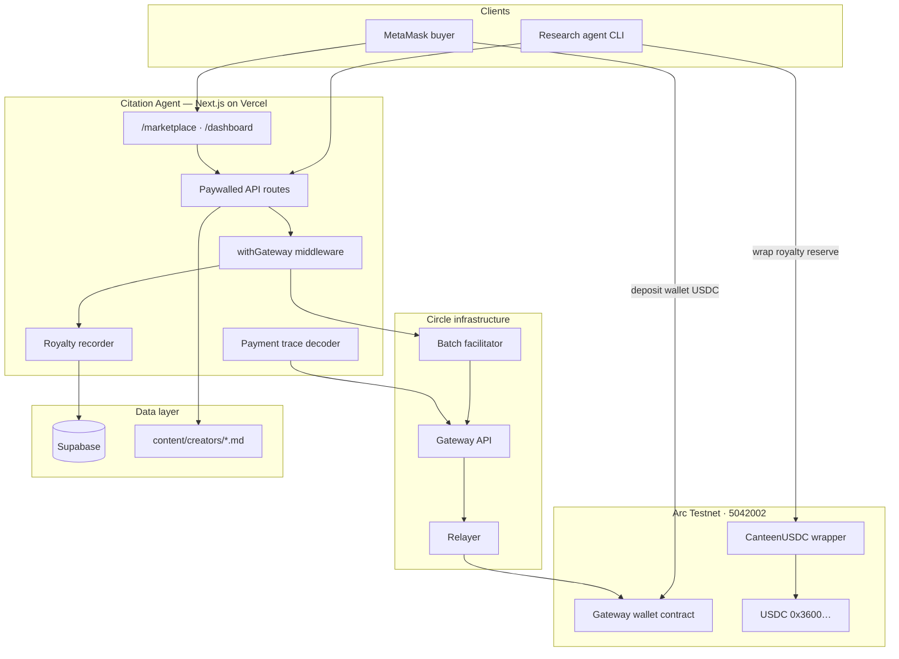
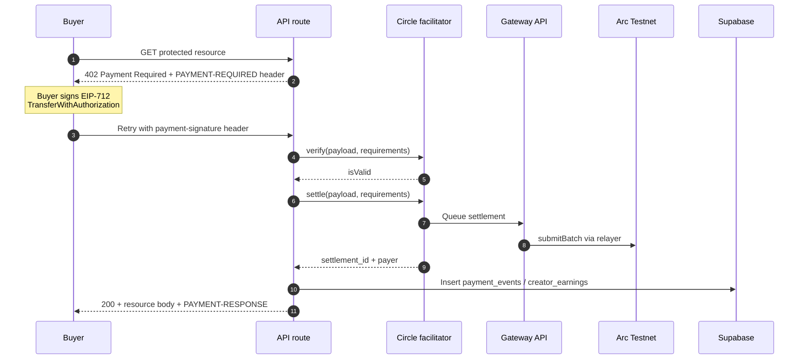
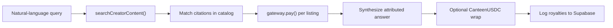

<div align="center">


# Citation Agent

**Pay-per-citation research with x402 nanopayments, Circle Gateway settlement, and CanteenUSDC creator royalties on Arc Testnet.**

[Circle Nanopayments](https://www.circle.com/nanopayments) · [Arc Testnet](https://docs.arc.network) · [x402](https://www.x402.org)

</div>

---

## Overview

Citation Agent is a full-stack reference implementation for agentic commerce over paywalled knowledge. Research agents discover creator markdown sources, settle micro-payments through Circle Gateway on Arc Testnet (chain ID `5042002`), and return answers with verifiable citation provenance. Creators receive a **70% / 30%** royalty split; optional **CanteenUSDC** wrapping reserves on-chain creator payouts.

| Capability | Description |
| --- | --- |
| Pay-per-citation | Agents query `content/creators/` and pay per matched passage |
| x402 + Gateway | Gasless batched USDC via EIP-712 authorizations and Circle facilitator |
| Marketplace demo | MetaMask connect, Gateway deposit, live payment trace |
| Royalty ledger | Supabase-backed earnings, agent reputation, settlement history |
| CanteenUSDC | Wrapper contract for creator royalty reserves on Arc |

---

## Architecture

### System context



### x402 settlement flow

Payments use **Gateway balance**, not raw wallet USDC. Buyers must deposit into the Gateway contract before paying.



### Research agent path



---

## Stack

| Layer | Technology |
| --- | --- |
| Application | Next.js 16 App Router, React 19, Tailwind CSS |
| Payments | x402 v2, `@circle-fin/x402-batching`, Circle Gateway |
| Chain | Arc Testnet, viem, USDC native gas |
| Royalties | CanteenUSDC (Foundry), 70/30 split |
| Data | Supabase Postgres + Realtime |
| Deploy | Vercel |

---

## Quick start

### Prerequisites

- Node.js 22+
- Supabase project ([supabase.com](https://supabase.com)) or local Supabase via Docker
- Arc Testnet USDC from the [Circle faucet](https://faucet.circle.com/)

### Install

```cmd
npm install
copy .env.example .env.local
npm run generate-wallets
```

Fund the buyer wallet address printed by `generate-wallets` at the Circle faucet.

### Database

```cmd
npx supabase link --project-ref YOUR_PROJECT_REF
npx supabase db push
```

Add Supabase URL and keys to `.env.local` (see `.env.example`).

### Run locally

```cmd
npm run dev
```

| Route | Purpose |
| --- | --- |
| `http://localhost:3000` | Landing |
| `http://localhost:3000/marketplace` | x402 demo + payment trace |
| `http://localhost:3000/dashboard` | Earnings and settlement monitor |

### Research agent

```cmd
npm run agent -- "How do nanopayments enable trust infrastructure?"
```

Continuous throughput demo (loops paywalled endpoints):

```cmd
npm run agent
```

### Marketplace pay flow (browser)

1. Connect MetaMask on `/marketplace` (auto-switches to Arc Testnet).
2. Confirm **Wallet** and **Gateway** balances — they are separate balances.
3. If Gateway is `$0`, click **Deposit to Gateway** and approve both MetaMask transactions.
4. Click **Pay $0.01 and call /hello** and sign the EIP-712 authorization.
5. Inspect the six-step settlement trace on the same page.

---

## API reference

### Marketplace (x402 + trace)

| Endpoint | Method | Price | Description |
| --- | --- | --- | --- |
| `/api/marketplace/hello` | GET | $0.01 | Hello-world paid resource |
| `/api/marketplace/citations?id=<id>` | GET | per listing | Paid creator citation + royalty record |
| `/api/marketplace/gateway-balance?address=` | GET | Free | Gateway USDC balance lookup |
| `/api/marketplace/settlement/<id>` | GET | Free | Settlement status from Gateway API |
| `/api/marketplace/batch-tx/<id>` | GET | Free | On-chain batch transaction hash |
| `/api/marketplace/decode-batch/<hash>` | GET | Free | Decode `submitBatch` calldata |

### Premium (agent loop)

| Endpoint | Method | Price | Description |
| --- | --- | --- | --- |
| `/api/premium/citation?id=<id>` | GET | $0.001 | Legacy citation endpoint |
| `/api/premium/citation/index` | GET | Free | Citation catalog |
| `/api/premium/quote` | GET | $0.001 | Sample quote |
| `/api/premium/dataset` | GET | $0.01 | Sample dataset |
| `/api/premium/compute` | POST | $0.0003 | Text analysis |
| `/api/premium/agent-task` | GET | $0.03 | Agent task clue |

### Creator content

Markdown sources live in `content/creators/` with frontmatter: `title`, `author`, `author_wallet`, `price_usdc`, `tags`.

---

## Environment variables

See [`.env.example`](.env.example). Required for production:

| Variable | Purpose |
| --- | --- |
| `NEXT_PUBLIC_SUPABASE_URL` | Supabase project URL |
| `NEXT_PUBLIC_SUPABASE_PUBLISHABLE_KEY` | Public anon key |
| `SUPABASE_SERVICE_ROLE_KEY` | Server-side writes |
| `SELLER_ADDRESS` / `SELLER_PRIVATE_KEY` | Payment recipient + withdrawals |
| `BUYER_ADDRESS` / `BUYER_PRIVATE_KEY` | Research agent funding wallet |
| `BASE_URL` | Public deployment URL (agent callbacks) |
| `ARC_TESTNET_RPC` | Arc JSON-RPC endpoint |
| `GATEWAY_API` | Circle Gateway facilitator URL |

Optional:

| Variable | Purpose |
| --- | --- |
| `CANTEEN_USDC_ADDRESS` | Deployed CanteenUSDC wrapper on Arc |
| `OPENAI_API_KEY` | LLM-driven agent routing |

---

## Arc Testnet notes

Arc uses **native USDC (18 decimals)** for gas and **ERC-20 USDC (6 decimals)** for payments. Gateway deposits move ERC-20 USDC into the Circle Gateway contract; x402 settlements debit the depositor's Gateway balance, not the wallet balance directly.

Parallel agents sharing one funder wallet should use the nonce retry logic in `agent.mts`. Push Supabase migrations before relying on the royalty dashboard.

---

## Deploy

1. Connect the repository to [Vercel](https://vercel.com).
2. Set all required environment variables in the Vercel dashboard.
3. Deploy from `main`.

`vercel.json` is included. Post-deploy, confirm `/llms.txt` is reachable for agent discoverability.

---

## Security

- **Testnet only.** Never reuse generated keys on mainnet.
- `.env.local` and private keys are gitignored.
- Server routes never expose `SELLER_PRIVATE_KEY` or `BUYER_PRIVATE_KEY` to the client.
- See [`SECURITY.md`](SECURITY.md) for reporting.

---

## License

Apache-2.0. Portions derived from the [arc-nanopayments](https://github.com/circlefin/arc-nanopayments) starter (Circle Internet Group, Inc.).