<div align="center">


# Citation Agent

**Researchers sell crypto research. Agents buy it.**

Crypto research marketplace on Arc Testnet: x402 + Circle Gateway USDC unlocks, creator royalties, TrustGate wallet scoring, and on-chain research backing.

[Live demo](https://agentcitation.xyz) · [Demo video](https://youtu.be/hZEROArwU3c) · [Arc Testnet](https://docs.arc.network) · [Circle Gateway](https://developers.circle.com) · [x402](https://www.x402.org)

</div>

---

## Overview

Citation Agent is a crypto research marketplace on **Arc Testnet**. Analysts publish paywalled reports; humans and agents unlock them with **USDC** via **x402** and **Circle Gateway**. Each unlock settles in full to the creator's payout wallet (royalty ledger in Supabase). Optional **TrustGate** wallet scores appear on cards. **Attestation.sol** lets anyone stake USDC behind a report or researcher. Settlement machinery stays visible on the dashboard without dominating the product surface.

| Layer | What users see | What runs underneath |
| --- | --- | --- |
| **Catalog** | Browse, sort, topic filter, unlock, cite | Markdown seeds + Supabase posts |
| **Publish** | Draft anytime · sign once to go live | Local autosave + server drafts + wallet publish sig; payout defaults from profile |
| **Account** | `/profile` setup · then `/u/@you` settings | Username, payout wallet, optional tip wallet, unlock earnings |
| **Profiles** | `/u/@name` · View → catalog · tip · back · follow | `platform_profiles`, `creator_follows`, tip x402 |
| **Reports** | `/r/{id}` shareable teaser + unlock CTA | Canonical share URL (also catalog deep-link) |
| **Commerce** | Per-report USDC unlock · optional tips | x402 v2, Gateway batch settlement, royalty ledger |
| **Identity** | `@username` on posts, comments, `@mentions` | `platform_profiles` + `profile_wallets` |
| **Discussion** | Threaded comments on unlocked posts | `post_comments`, unlock gate, agent session only |
| **Endorsements** | Stamp work you stand behind · Curation tab | `post_endorsements`, stamp counts on cards and desks |
| **Curator credit** | Referral links accrue credit on routed unlocks | `unlock_attributions` ledger (off-chain accrual) |
| **Proof of judgment** | Signal outcomes, accuracy, resolution rate | `signal_resolutions` + USDC dispute window on existing attestation rails |
| **Demand** | Agent vs human buying, top and rising desks, just resolved | Aggregated from `creator_earnings` + `user_agent_wallets` |
| **Niches** | Browse by sector · deep-links the topic filter | Static tag→sector map (`lib/sectors.ts`) |
| **Trust** | Optional score on cards | TrustGate arc-score (free) + paid verify (cached) |
| **Backing** | Stake behind a report or researcher | `Attestation.sol`, Arcscan-first claims index, multi-RPC stake |
| **Agents** | CLI research loop · browser agent wallet | Session wallet, WalletConnect, Gateway pay |

Architecture (unlock → payout sequence): [docs/ARCHITECTURE.md](docs/ARCHITECTURE.md)  
Extended product reference: [docs/platform-overview.md](docs/platform-overview.md)  
Product roadmap (live foundation + judgment marketplace plan): [docs/roadmap.md](docs/roadmap.md)

---

## System architecture

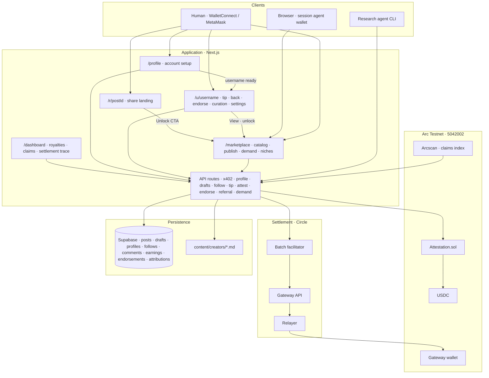
```mermaid
flowchart TB
  subgraph Clients["Clients"]
    Human["Human · WalletConnect / MetaMask"]
    Agent["Research agent CLI"]
    BrowserAgent["Browser · session agent wallet"]
  end

  subgraph Application["Application · Next.js"]
    Marketplace["/marketplace · catalog · publish · demand · niches"]
    Setup["/profile · account setup"]
    Profiles["/u/username · tip · back · endorse · curation · settings"]
    Reports["/r/postId · share landing"]
    Dashboard["/dashboard · royalties · claims · settlement trace"]
    APIs["API routes · x402 · profile · drafts · follow · tip · attest · endorse · referral · demand"]
  end

  subgraph Settlement["Settlement · Circle"]
    Facilitator["Batch facilitator"]
    GatewayAPI["Gateway API"]
    Relayer["Relayer"]
  end

  subgraph Chain["Arc Testnet · 5042002"]
    GatewayWallet["Gateway wallet"]
    USDC["USDC"]
    Attestation["Attestation.sol"]
    Arcscan["Arcscan · claims index"]
  end

  subgraph Persistence["Persistence"]
    Supabase[("Supabase · posts · drafts · profiles · follows · comments · earnings · endorsements · attributions")]
    Seeds["content/creators/*.md"]
  end

  Human --> Marketplace
  Human --> Setup
  Setup -->|"username ready"| Profiles
  Human --> Profiles
  Human --> Reports
  BrowserAgent --> Marketplace
  Profiles -->|"View · unlock"| Marketplace
  Reports -->|"Unlock CTA"| Marketplace
  Agent --> APIs
  Marketplace --> APIs
  Profiles --> APIs
  Setup --> APIs
  Dashboard --> APIs
  APIs --> Facilitator
  Facilitator --> GatewayAPI --> Relayer --> GatewayWallet
  APIs --> Attestation
  Attestation --> USDC
  Arcscan --> APIs
  APIs --> Seeds
  APIs --> Supabase
```

---

## Research unlock flow

Buyers fund a **Gateway balance** first. Unlock debits that balance — not the wallet directly. Agent-wallet unlocks are remembered across refresh via `creator_earnings`; the same browser session also caches bodies in `sessionStorage`.

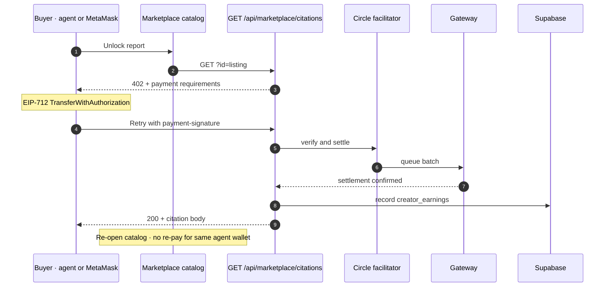
```mermaid
sequenceDiagram
  autonumber
  participant Buyer as Buyer · agent or MetaMask
  participant UI as Marketplace catalog
  participant API as GET /api/marketplace/citations
  participant Fac as Circle facilitator
  participant GW as Gateway
  participant DB as Supabase

  Buyer->>UI: Unlock report
  UI->>API: GET ?id=listing
  API-->>Buyer: 402 + payment requirements
  Note over Buyer: EIP-712 TransferWithAuthorization
  Buyer->>API: Retry with payment-signature
  API->>Fac: verify and settle
  Fac->>GW: queue batch
  GW-->>API: settlement confirmed
  API->>DB: record creator_earnings
  API-->>Buyer: 200 + citation body
  Note over UI: Re-open catalog · no re-pay for same agent wallet
```

---

## Session agent wallet

Browser buyers use a **session agent wallet** — encrypted in Supabase, bound to an `agent_session` cookie (90-day max, 30-day rotation). Paste a recovery wallet address at **create** (no popup). On another device, click **Connect wallet** (WalletConnect on phone, MetaMask on desktop) and **sign** to restore the same wallet and Gateway balance. The wallet modal never opens on page load — only after you click Connect.

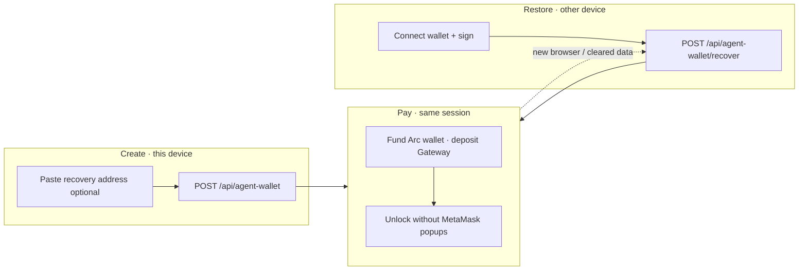
```mermaid
flowchart LR
  subgraph Create["Create · this device"]
    C1["Paste recovery address optional"]
    C2["POST /api/agent-wallet"]
    C1 --> C2
  end

  subgraph Use["Pay · same session"]
    U1["Fund Arc wallet · deposit Gateway"]
    U2["Unlock without MetaMask popups"]
    U1 --> U2
  end

  subgraph Restore["Restore · other device"]
    R1["Connect wallet + sign"]
    R2["POST /api/agent-wallet/recover"]
    R1 --> R2
  end

  C2 --> Use
  Use -.->|new browser / cleared data| R2
  R2 --> Use
```

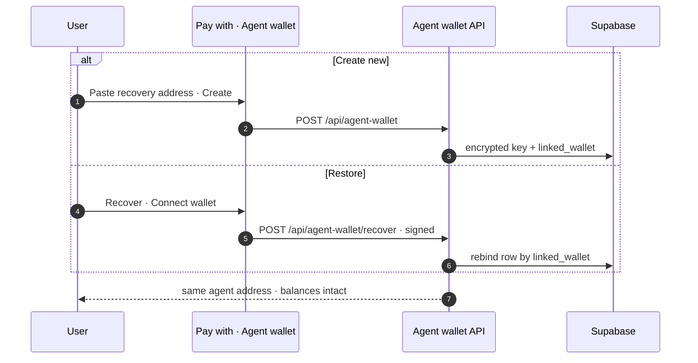
```mermaid
sequenceDiagram
  autonumber
  participant User
  participant UI as Pay with · Agent wallet
  participant API as Agent wallet API
  participant DB as Supabase

  alt Create new
    User->>UI: Paste recovery address · Create
    UI->>API: POST /api/agent-wallet
    API->>DB: encrypted key + linked_wallet
  else Restore
    User->>UI: Recover · Connect wallet
    UI->>API: POST /api/agent-wallet/recover · signed
    API->>DB: rebind row by linked_wallet
  end
  API-->>User: same agent address · balances intact
```

Setup UI: landing → choose Recover or Create → step 2. Re-tap **Agent wallet** to go back. Full reference: [docs/platform-overview.md](docs/platform-overview.md#session-agent-wallets).

---

## Platform identity and comments

Researchers and readers share one **platform username** (`@name`, 3–24 chars, lowercase). Account setup lives at **`/profile`**: connect a wallet, choose a username, then one signature silently defaults the **payout wallet** to the signing address (same rule as first publish if that step is skipped). The header **Profile** link goes to `/profile` when unset, or `/u/{you}` when ready. A 7-day cooldown applies between username changes (UI shows remaining time and unlock datetime).

Reading and unlocking reports need **no** account. Publishing and commenting require a username.

Comments are available only on **unlocked** posts. Readers comment via the session agent wallet (no MetaMask popups). Replies are threaded via `parentId`. Type `@username` in comments or teasers to link to that creator’s public profile.

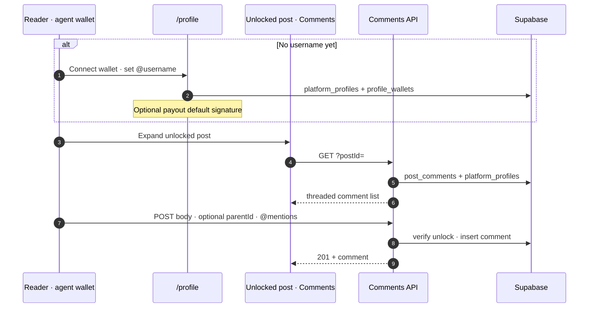
```mermaid
sequenceDiagram
  autonumber
  participant Reader as Reader · agent wallet
  participant Setup as /profile
  participant UI as Unlocked post · Comments
  participant Comments as Comments API
  participant DB as Supabase

  alt No username yet
    Reader->>Setup: Connect wallet · set @username
    Setup->>DB: platform_profiles + profile_wallets
    Note over Setup: Optional payout default signature
  end
  Reader->>UI: Expand unlocked post
  UI->>Comments: GET ?postId=
  Comments->>DB: post_comments + platform_profiles
  Comments-->>UI: threaded comment list
  Reader->>Comments: POST body · optional parentId · @mentions
  Comments->>DB: verify unlock · insert comment
  Comments-->>UI: 201 + comment
```

---

## Publish and drafts

Creators expand **Publish research** on the marketplace after account setup. Connect wallet (if needed), write or **import paste** markdown, set price / tags / cover / schedule, **Save draft** anytime, then **Sign and publish** once. There is **no** payout field on the publish form: the profile default is used; on a first publish with nothing stored, the signing wallet becomes the default.

| Layer | Behavior |
| --- | --- |
| Account | `/profile` if no username · publish shows “Set up your account” |
| Local autosave | `localStorage` per connected wallet while typing (no signature) |
| Server draft | `POST /api/marketplace/drafts` · my-posts signature · `status = draft` |
| Live post | Publish payload signature · `status = published` · share link `/r/{id}` |
| Payout | Profile default (or silent first-publish default) · not edited on this form |
| Earnings | **Unlock earnings** panel lives on profile settings, not publish |

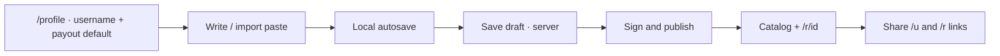
```mermaid
flowchart LR
  Setup["/profile · username + payout default"] --> Write["Write / import paste"]
  Write --> Local["Local autosave"]
  Local --> Draft["Save draft · server"]
  Draft --> Sign["Sign and publish"]
  Sign --> Live["Catalog + /r/id"]
  Live --> Share["Share /u and /r links"]
```

---

## Public profiles, follow, and tips

| Surface | Purpose |
| --- | --- |
| `/profile` | Compulsory setup when no username; redirects to `/u/{you}` when ready |
| `/u/{username}` | Public desk: stats, reports, follow, tip, back · **owner** also gets settings |
| Owner settings | Payout wallet · optional tip wallet override · unlock earnings · verification |
| Report cards on profile | Teaser only · **View** opens catalog deep-link for unlock/read |
| Hero **Follow** | Discover publishers who have at least one live report |
| Following panel | Feed of posts from desks you follow (marketplace, below catalog) |
| Tip | USDC via Gateway · **tip wallet if set**, else payout wallet (then post/publisher fallbacks) |
| Back researcher | Same on-chain stake flow as catalog (`author:@name`) |

Header nav: **Research · Dashboard · Profile** (Payment Trace is a dashboard tab / marketplace card, not top nav).

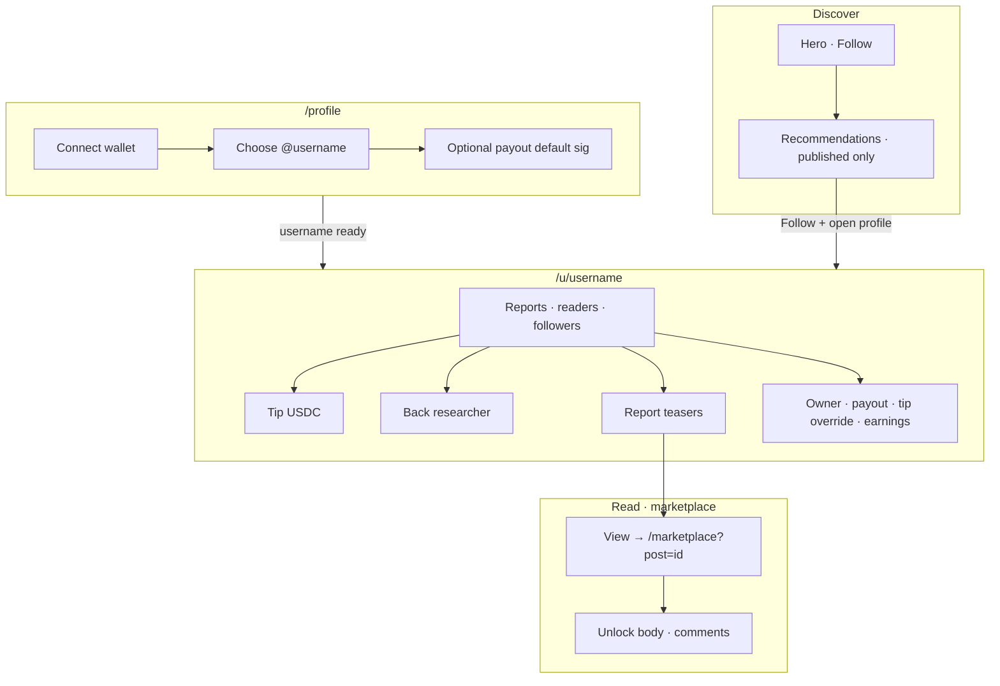
```mermaid
flowchart TB
  subgraph Discover["Discover"]
    Hero["Hero · Follow"]
    Recs["Recommendations · published only"]
    Hero --> Recs
  end

  subgraph Setup["/profile"]
    Connect["Connect wallet"]
    Username["Choose @username"]
    PayoutDefault["Optional payout default sig"]
    Connect --> Username --> PayoutDefault
  end

  subgraph Profile["/u/username"]
    Stats["Reports · readers · followers"]
    Tip["Tip USDC"]
    Back["Back researcher"]
    Cards["Report teasers"]
    Settings["Owner · payout · tip override · earnings"]
    Stats --> Tip
    Stats --> Back
    Stats --> Cards
    Stats --> Settings
  end

  subgraph Read["Read · marketplace"]
    View["View → /marketplace?post=id"]
    Unlock["Unlock body · comments"]
    View --> Unlock
  end

  Setup -->|"username ready"| Profile
  Recs -->|"Follow + open profile"| Profile
  Cards --> View
```

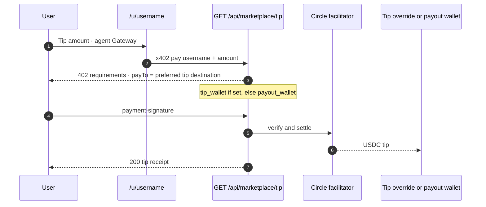
```mermaid
sequenceDiagram
  autonumber
  participant User
  participant Profile as /u/username
  participant Tip as GET /api/marketplace/tip
  participant Fac as Circle facilitator
  participant Payee as Tip override or payout wallet

  User->>Profile: Tip amount · agent Gateway
  Profile->>Tip: x402 pay username + amount
  Tip-->>User: 402 requirements · payTo = preferred tip destination
  Note over Tip: tip_wallet if set, else payout_wallet
  User->>Tip: payment-signature
  Tip->>Fac: verify and settle
  Fac-->>Payee: USDC tip
  Tip-->>User: 200 tip receipt
```

---

## Research backing and reputation

Backing is framed as commerce copy on catalog cards (`Back this research` / `Back this researcher`). Stakes are public on-chain claims grouped by canonical target (`author:…`, `citation:…`). Minimum stake **0.1 USDC** plus **0.1 USDC** platform fee. Reputation is optional per card — free badge when configured, paid verify when the user opts in.

**Claims index** prefers **Arcscan** transaction history over public `eth_getLogs` (the public Arc RPC rate-limits under dashboard load). Agent-wallet stakes go through `POST /api/attestation` with a multi-endpoint RPC fallback; if the route returns rate-limited **before** broadcast, nothing was staked and a retry is safe.

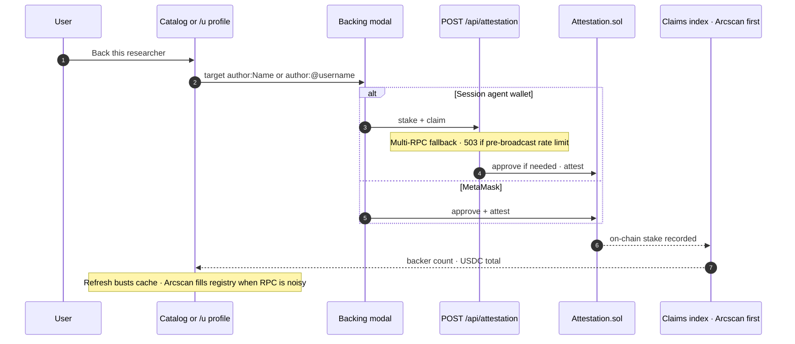
```mermaid
sequenceDiagram
  autonumber
  participant User
  participant Card as Catalog or /u profile
  participant Modal as Backing modal
  participant API as POST /api/attestation
  participant Chain as Attestation.sol
  participant Index as Claims index · Arcscan first

  User->>Card: Back this researcher
  Card->>Modal: target author:Name or author:@username
  alt Session agent wallet
    Modal->>API: stake + claim
    Note over API: Multi-RPC fallback · 503 if pre-broadcast rate limit
    API->>Chain: approve if needed · attest
  else MetaMask
    Modal->>Chain: approve + attest
  end
  Chain-->>Index: on-chain stake recorded
  Index-->>Card: backer count · USDC total
  Note over Card: Refresh busts cache · Arcscan fills registry when RPC is noisy
```

---

## Endorsements and curator credit

Desks **endorse** research or signals they stand behind. A stamp is a public taste signal and the entry point to curator economics: endorsing mints a referral link, and unlocks routed through it accrue **curator credit**.

**Settlement is unchanged.** An unlock still pays 100% on-chain to the creator's payout wallet through the same single-payee x402 rails. Curator credit accrues off-chain in `unlock_attributions` with `settled_at = null`; paying it out is deliberately deferred (see [roadmap](docs/roadmap.md)).

| Rule | Value |
| --- | --- |
| Endorsed rate | 10% of the unlock price |
| Plain referral rate | 5% |
| Rounding | Truncated to 6dp, so credit can never exceed gross |
| Self-endorsement | Blocked — you cannot stamp your own post |
| Self-referral | Blocked — buyer wallet resolving to the curator earns nothing |
| Double credit | Blocked — unique on `(post_id, payer)`; repeat unlocks do not re-mint |

The referral code rides the **unlock query string**, not the cookie. The MetaMask path sends cookies, but the agent path proxies server-side through `/api/gateway/pay` where cookies do not propagate and only the path survives.

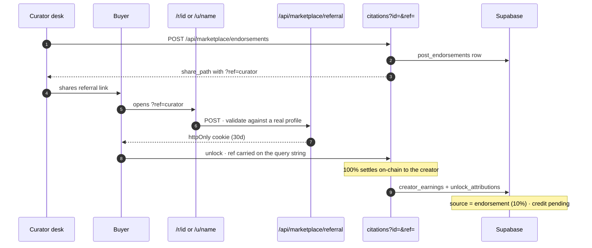
```mermaid
sequenceDiagram
  autonumber
  participant Curator as Curator desk
  participant Buyer
  participant Landing as /r/id or /u/name
  participant Ref as /api/marketplace/referral
  participant API as citations?id=&ref=
  participant DB as Supabase

  Curator->>API: POST /api/marketplace/endorsements
  API->>DB: post_endorsements row
  API-->>Curator: share_path with ?ref=curator
  Curator->>Buyer: shares referral link
  Buyer->>Landing: opens ?ref=curator
  Landing->>Ref: POST · validate against a real profile
  Ref-->>Buyer: httpOnly cookie (30d)
  Buyer->>API: unlock · ref carried on the query string
  Note over API: 100% settles on-chain to the creator
  API->>DB: creator_earnings + unlock_attributions
  Note over DB: source = endorsement (10%) · credit pending
```

---

## Proof of judgment — signal resolution

A desk files an outcome on its own Signal Card against the **invalidation condition it pre-committed at publish**. The resolution is written once and cannot be edited: an editable outcome log would be worthless as proof.

An outcome is **provisional** for 72 hours. During that window anyone can challenge it by staking USDC against `resolution:{postId}` through the existing `Attestation.sol` rails — no new contract, no new payment path. The stake tx is verified on Arc before the dispute is accepted. A disputed outcome is frozen out of accuracy until an operator adjudicates.

| State | Meaning | Counts toward accuracy |
| --- | --- | --- |
| `unresolved` | No outcome yet, horizon still running | No |
| `expired_unresolved` | Horizon passed, no outcome filed | No — drags resolution rate down |
| `provisional` | Filed, inside the 72h dispute window | No |
| `final` | Window closed undisputed | Yes |
| `disputed` | Challenged with a USDC stake | No — frozen until settled |
| `adjudicated` | Operator settled the dispute | Yes (adjudicated outcome stands) |

**Two public numbers, on purpose.** Accuracy asks *when you called it, were you right* — `right / (right + wrong)`, with `void` excluded from the denominator. Resolution rate asks *do you close the loop, or bury losers*. Accuracy alone is trivially gamed by only ever resolving winners, so silence is made visible rather than rewarded.

Only `30d` and `90d` horizons expire. `event` and `open` signals are never marked overdue — penalising a creator for a deadline they never claimed would be wrong.

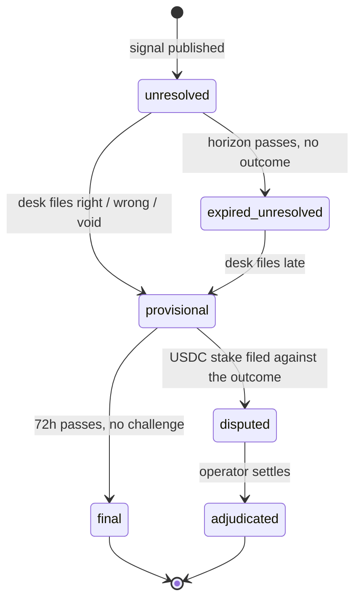
```mermaid
stateDiagram-v2
  [*] --> unresolved: signal published
  unresolved --> expired_unresolved: horizon passes, no outcome
  unresolved --> provisional: desk files right / wrong / void
  expired_unresolved --> provisional: desk files late
  provisional --> final: 72h passes, no challenge
  provisional --> disputed: USDC stake filed against the outcome
  disputed --> adjudicated: operator settles
  final --> [*]
  adjudicated --> [*]
```

---

## Demand surfaces and niche discovery

The marketplace carries a collapsed **Demand** board and a **Browse by niche** lane under the catalog. Both are read-only aggregations over the existing unlock ledger — no new writes, no new payment rails — and lazy-load on first expand.

| Surface | Derived from |
| --- | --- |
| Agent vs human split | Payer wallet matched against `user_agent_wallets` (lowercased both sides) |
| Top desks | Unlock count then earnings, in the selected window |
| Rising desks | **Period-over-period growth** vs the preceding equal-length window |
| Top signals / research | Unlocks per post in the window |
| Conviction changes | A desk publishing a new signal on a theme it covered, with a different direction |
| Just resolved | Newest signal outcomes, labelled provisional / disputed / final |
| Niches | Free-form tags folded into 9 stable sectors, deep-linking `?tag=` into the catalog filter |

Two deliberate design choices worth stating:

- **Rising is growth, not share of lifetime.** Share-of-lifetime scores every desk identically in a marketplace younger than the window, which makes the lane a duplicate of the top-desk list.
- **Resolutions shipped in Phase 3.** The "just resolved" lane is live and `resolutions_available` returns `true`. Provisional and disputed outcomes are labelled, so the lane never implies a settled result that is still being challenged.

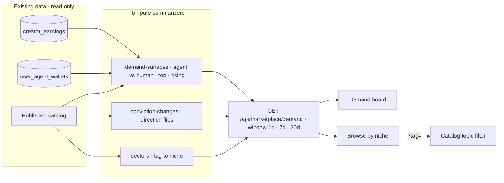
```mermaid
flowchart LR
  subgraph Ledger["Existing data · read only"]
    Earnings[("creator_earnings")]
    AgentWallets[("user_agent_wallets")]
    Catalog["Published catalog"]
  end

  subgraph Aggregate["lib · pure summarizers"]
    Demand["demand-surfaces · agent vs human · top · rising"]
    Conviction["conviction-changes · direction flips"]
    Sectors["sectors · tag to niche"]
  end

  API["GET /api/marketplace/demand · window 1d · 7d · 30d"]
  Board["Demand board"]
  Lanes["Browse by niche"]
  Filter["Catalog topic filter"]

  Earnings --> Demand
  AgentWallets --> Demand
  Catalog --> Demand
  Catalog --> Conviction
  Catalog --> Sectors
  Demand --> API
  Conviction --> API
  Sectors --> API
  API --> Board
  API --> Lanes
  Lanes -->|"?tag="| Filter
```

---

## Stack

| Layer | Technology |
| --- | --- |
| Application | Next.js 16, React 19, Tailwind CSS, shadcn/ui |
| Payments | x402 v2, Circle Gateway, viem |
| Attestations | Solidity, Foundry, Arc USDC |
| Chain | Arc Testnet (5042002) |
| Data | Supabase Postgres (publish, royalties, agent wallets, paid trust cache) |
| Deploy | Vercel |

---

## Quick start

**Prerequisites:** Node.js 22+, Arc Testnet USDC ([Circle faucet](https://faucet.circle.com/))

```cmd
git clone https://github.com/rudazy/citation-agent.git
cd citation-agent
npm install
copy .env.example .env.local
npm run generate-wallets
```

Edit `.env.local` with real values. **Never commit `.env.local` or any `*_PRIVATE_KEY`.** If a private key is exposed, rotate it immediately.

### Minimum env (local UI + x402 unlock against seed catalog)

| Variable | Why |
| --- | --- |
| `SELLER_ADDRESS` / `SELLER_PRIVATE_KEY` | x402 payee for legacy seeds; withdrawals |
| `BUYER_ADDRESS` / `BUYER_PRIVATE_KEY` | CLI funder / smoke tests only |
| `AGENT_WALLET_ENCRYPTION_KEY` | Encrypts in-app session agent wallets (32+ chars) |
| `ARC_TESTNET_RPC` | Arc Testnet RPC |
| `ATTESTATION_*` / `NEXT_PUBLIC_ATTESTATION_ADDRESS` | Backing flows (optional for unlock-only) |
| `NEXT_PUBLIC_SITE_URL` / `BASE_URL` | `http://localhost:3000` locally |
| `NEXT_PUBLIC_WALLETCONNECT_PROJECT_ID` | Mobile WalletConnect (optional on desktop MetaMask) |

### Full marketplace (publish, royalties UI, agent restore, comments)

Also set Supabase URL + anon/publishable key + **`SUPABASE_SERVICE_ROLE_KEY`** (never commit), then apply migrations in `supabase/migrations/` (agent wallets, publish, usernames, comments, drafts, follows, signals, endorsements, attributions).

With the Supabase CLI linked to your project:

```cmd
npx supabase link --project-ref <your-project-ref>
npx supabase db push
```

Or per file, without the CLI:

```cmd
npx tsx scripts/apply-sql-migration.mts supabase/migrations/<migration>.sql
```

If migrations were applied by hand in the SQL editor, the CLI's history table will not know about them and `db push` will try to replay everything. Verify the schema first, then record them without executing: `npx supabase migration repair --status applied <version...>`.

Optional TrustGate badges: append vars from [`.env.local.example`](.env.local.example) into `.env.local`.

Script-only keys (documented in `.env.example` with never-commit warnings): `DEPLOYER_PRIVATE_KEY`, `PUBLISHER_PRIVATE_KEY`.

```cmd
npm run dev
```

Open [http://localhost:3000](http://localhost:3000). Create a session agent wallet, fund it from the faucet, deposit to Gateway, then unlock a catalog report.

| Route | Purpose |
| --- | --- |
| `/` | Redirects to `/marketplace` |
| `/marketplace` | Publish (signal, research), catalog, demand board, niche lanes, following feed, unlock |
| `/profile` | Account setup (no username) · redirects to `/u/{you}` when ready |
| `/u/{username}` | Public desk · tip · back · follow · endorse · Curation tab · owner settings / earnings |
| `/r/{postId}` | Shareable report teaser · unlock CTA into catalog |
| `/dashboard` | Payments, royalties, withdrawals, operator fees, claims, settlement trace tab |

**Research agent**

```cmd
npm run agent -- "Hyperliquid market structure"
npm run agent -- "stablecoin yield" --min-trust 50
```

**Operator scripts** (dev server + env required)

```cmd
npx tsx scripts/generate-research-seeds.mts
npx tsx scripts/publish-research-posts.mts
npx tsx scripts/archive-catalog-noise.mts
```

**Smoke tests**

```cmd
npm run smoke:marketplace
npm run smoke:marketplace:full
```

Unit tests (no live keys required for the default suite):

```cmd
npm run test
```

---

## API summary

### Marketplace

| Endpoint | Auth | Notes |
| --- | --- | --- |
| `GET /api/marketplace/citations` | Public | Catalog metadata, backing stats, prior unlocks for session agent |
| `GET /api/marketplace/citations?id=` | x402 | Unlock body; records earnings |
| `GET /api/marketplace/citations?refresh=1` | Public | Bust attestation cache after new backing |
| `POST /api/marketplace/citations` | Wallet signature | Publish a post (requires `@username`) |
| `GET /api/marketplace/drafts` | my-posts signature | List server drafts for connected wallet |
| `POST /api/marketplace/drafts` | my-posts signature | Create/update draft (`status = draft`) |
| `DELETE /api/marketplace/drafts?id=` | my-posts signature | Delete a draft |
| `GET /api/marketplace/comments?postId=` | Public | Threaded comments for a post |
| `POST /api/marketplace/comments` | Session agent | Comment or reply (unlock required); `@mentions` supported in body |
| `GET /api/marketplace/tip?username=&amount=` | x402 | Tip USDC · payTo = tip override if set, else payout (then post/publisher fallbacks) |
| `GET /api/marketplace/follow` | Session + username | List followed creators |
| `POST /api/marketplace/follow` | Session + username | Follow a publisher `@username` |
| `DELETE /api/marketplace/follow?username=` | Session + username | Unfollow |
| `GET /api/marketplace/follow/recommendations` | Session | Publishers with ≥1 published report |
| `GET /api/marketplace/following/feed` | Session | Recent posts from followed creators |
| `GET /api/marketplace/profiles/{username}` | Public | Public desk metadata, report teasers, endorsement counts, curation list |
| `GET /api/marketplace/gateway-balance` | Session / wallet | Creator Gateway balance for unlock-earnings UI |
| `GET /api/marketplace/endorsements?postId=` | Public | Endorsers of a post |
| `POST /api/marketplace/endorsements` | Session + username | Stamp a post (not your own); returns `share_path` with `?ref=` |
| `DELETE /api/marketplace/endorsements?postId=` | Session + username | Remove your stamp |
| `GET /api/marketplace/referral` | Public | Read the stored referral code (httpOnly cookie) |
| `POST /api/marketplace/referral` | Public | Store a `?ref=` code after validating it against a real profile |
| `DELETE /api/marketplace/referral` | Public | Clear the stored code |
| `GET /api/marketplace/demand?window=` | Public | Aggregate demand board: agent vs human, top/rising desks, conviction changes, sectors, just-resolved. Aggregates only — never returns ledger rows, payers, or wallets |
| `GET /api/marketplace/resolutions?postId=` | Public | Signal outcome + derived state (status, dispute window, accuracy eligibility) |
| `POST /api/marketplace/resolutions` | Session + username | File an outcome on your own signal (right / wrong / void). Immutable |
| `POST /api/marketplace/resolutions/dispute` | On-chain stake | Challenge an outcome; tx verified against `Attestation.sol` for target and minimum stake |
| `POST /api/marketplace/resolutions/adjudicate` | Operator signature | Settle a disputed outcome |

### Profile

| Endpoint | Auth | Notes |
| --- | --- | --- |
| `GET /api/profile` | Session | Username, cooldown, agent status; owner-only `payoutWallet` / `tipWallet` |
| `GET /api/profile?publisher=` | Session | Resolve profile across agent + publisher wallets |
| `POST /api/profile` | Session agent | Set or change username; optional `publisherAddress` link |
| `POST /api/profile/payout-wallet` | my-posts signature | Set default payout wallet (also used for unlock settlement) |
| `POST /api/profile/tip-wallet` | my-posts signature | Set or clear optional tip override (`null` / empty clears) |

### Gateway and agent wallet

| Endpoint | Auth | Notes |
| --- | --- | --- |
| `POST /api/gateway/deposit` | Session agent | Deposit USDC into Gateway |
| `POST /api/gateway/pay` | Session agent | Pay allowlisted x402 paths |
| `GET /api/agent-wallet` | Session | Status, balances, linked recovery address |
| `POST /api/agent-wallet` | Session | Provision wallet; optional `{ recoveryWallet }` at create |
| `POST /api/agent-wallet/link` | Session | Paste or signed link to set/verify recovery address |
| `GET /api/agent-wallet/recoverable?address=` | Public | Check if address has a linked agent wallet |
| `POST /api/agent-wallet/recover` | Wallet sign | Restore wallet on new device by linked address |

### Trust and backing

| Endpoint | Auth | Notes |
| --- | --- | --- |
| `GET /api/trustgate/score?postId=` | Public | Free or cached score |
| `POST /api/trustgate/score` | Payment proof | Paid verify; Supabase-backed cache |
| `POST /api/attestation` | Session agent | Server-side stake · multi-RPC; 503 if rate-limited before broadcast |
| `GET /api/attestation/claims` | Public | Registry (Arcscan-first index); `?refresh=1` busts cache |

Catalog merges **markdown seeds** (`content/creators/`) and **Supabase posts** (`creator_posts`). Markdown seeds resolve trust identity to `NEXT_PUBLIC_OPERATOR_ADDRESS` unless `MARKETPLACE_IDENTITY_WALLET` is set.

---

## Environment

1. Copy [`.env.example`](.env.example) → `.env.local`.
2. Optionally append TrustGate keys from [`.env.local.example`](.env.local.example).
3. Run `npm run generate-wallets` if you need new seller/buyer pairs.

**Never commit** real `*_PRIVATE_KEY`, `SUPABASE_SERVICE_ROLE_KEY`, or `AGENT_WALLET_ENCRYPTION_KEY` values. Placeholders in the examples are not credentials. If a key leaks, rotate it and treat any funded wallet as compromised.

| Variable | Purpose |
| --- | --- |
| `SELLER_ADDRESS` / `SELLER_PRIVATE_KEY` | Platform x402 payee; legacy seed fallback |
| `BUYER_ADDRESS` / `BUYER_PRIVATE_KEY` | CLI funder (`npm run agent`, `npm run attest`) |
| `DEPLOYER_PRIVATE_KEY` | Script-only attestation deploy; falls back to `BUYER_PRIVATE_KEY`. **Never commit.** |
| `PUBLISHER_PRIVATE_KEY` | Script-only seed publisher. **Never commit.** |
| `DEPOSIT_AMOUNT` | Optional CLI Gateway deposit size (default `1`) |
| `ATTESTATION_ADDRESS` / `NEXT_PUBLIC_ATTESTATION_ADDRESS` | `Attestation.sol` |
| `ATTESTATION_DEPLOY_BLOCK` | Event indexer start block |
| `NEXT_PUBLIC_OPERATOR_ADDRESS` | Platform fee recipient; markdown seed trust identity |
| `ARC_TESTNET_RPC` / `NEXT_PUBLIC_ARC_TESTNET_RPC` | Server / client RPC primary (public Arc default if unset) |
| `ARC_TESTNET_RPC_FALLBACKS` | Optional comma-separated extras; built-in public fallbacks (Blockdaemon, dRPC, QuickNode, thirdweb) always append |
| `GATEWAY_API` | Circle Gateway API |
| `AGENT_WALLET_ENCRYPTION_KEY` | Encrypts per-session agent keys (32+ chars); keep stable across deploys |
| `NEXT_PUBLIC_SITE_URL` / `BASE_URL` | Official origin (`https://agentcitation.xyz` in production) |
| `NEXT_PUBLIC_WALLETCONNECT_PROJECT_ID` | Reown AppKit / WalletConnect; allowlist origin in [dashboard.reown.com](https://dashboard.reown.com) |
| Supabase URL, anon key, `SUPABASE_SERVICE_ROLE_KEY` | Publish, drafts, profiles, follows, comments, tips ledger, agent wallets |

**TrustGate (optional)** — full key list in `.env.local.example`

| Variable | Purpose |
| --- | --- |
| `TRUSTGATE_SCORE_API_URL` | Free reader — `https://www.trustgated.xyz/api/arc-score/{address}` |
| `TRUSTGATE_ORACLE_URL` | Paid verify — `https://www.trustgated.xyz/api/oracle/{address}` (not a direct oracle host) |
| `SCORING_WALLET_*` (full set) | Wallet-rescore caps — **required for accurate badges** |
| `TRUSTGATE_TIMEOUT_MS` | Upstream arc-score timeout (default `12000` ms) |
| `TRUSTGATE_PAID_CACHE_TTL_MS` | Paid score cache TTL (Supabase + memory) |

---

## Deployed contracts (Arc Testnet)

| Contract | Address |
| --- | --- |
| Attestation | `0xc8886a68f2160a57a01b32aae542b6eec5ca3d02` |
| USDC | `0x3600000000000000000000000000000000000000` |
| Gateway wallet | `0x0077777d7EBA4688BDeF3E311b846F25870A19B9` |

Indexer start block: `48323587` (override with `ATTESTATION_DEPLOY_BLOCK` if redeployed).

[Attestation verified on Arcscan](https://testnet.arcscan.app/address/0xc8886a68f2160a57a01b32aae542b6eec5ca3d02#code)

---

## Deploy

1. Connect the repository to [Vercel](https://vercel.com).
2. Set environment variables from `.env.example`.
3. Apply Supabase migrations on the production project.
4. Deploy from `main`.

Post-deploy: confirm [https://agentcitation.xyz/llms.txt](https://agentcitation.xyz/llms.txt) is reachable and the marketplace catalog loads with research listings.

---

## Security

- **Testnet only.** Do not reuse generated keys on mainnet.
- Private keys remain server-side; never expose them to the client.
- Never commit `.env.local` or real private keys. See [`SECURITY.md`](SECURITY.md) for reporting.

---

## License

Apache-2.0. Portions derived from the [arc-nanopayments](https://github.com/circlefin/arc-nanopayments) starter (Circle Internet Group, Inc.).