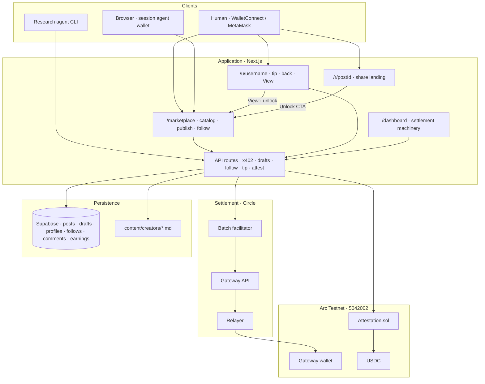
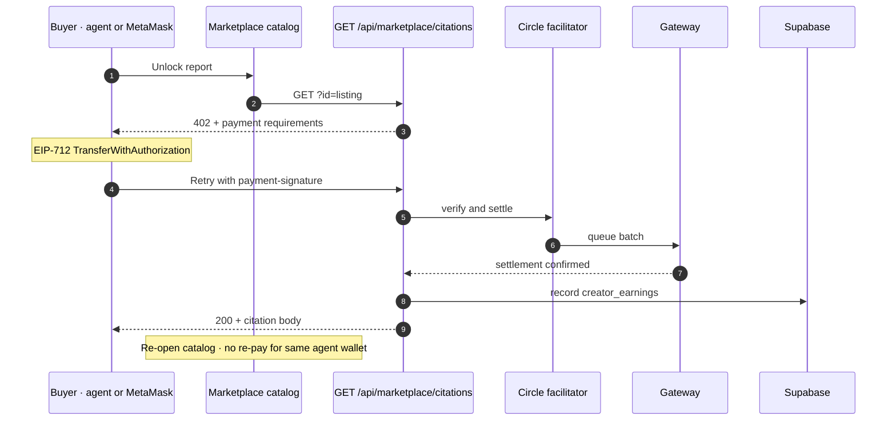
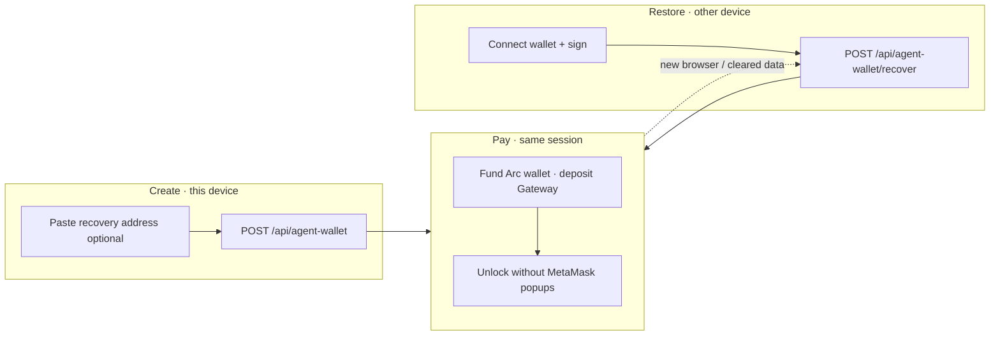
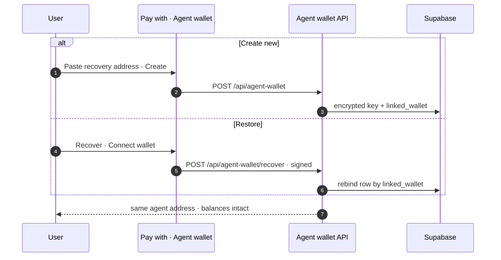
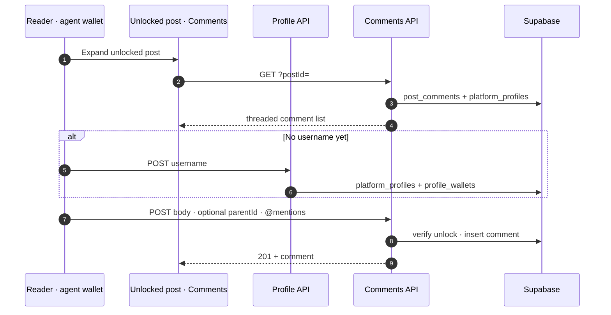
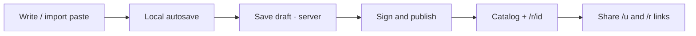
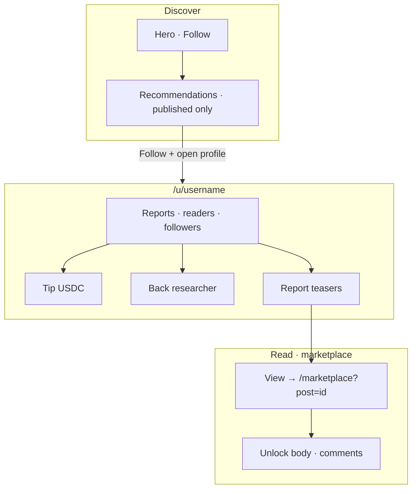
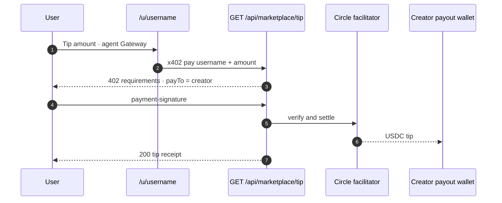
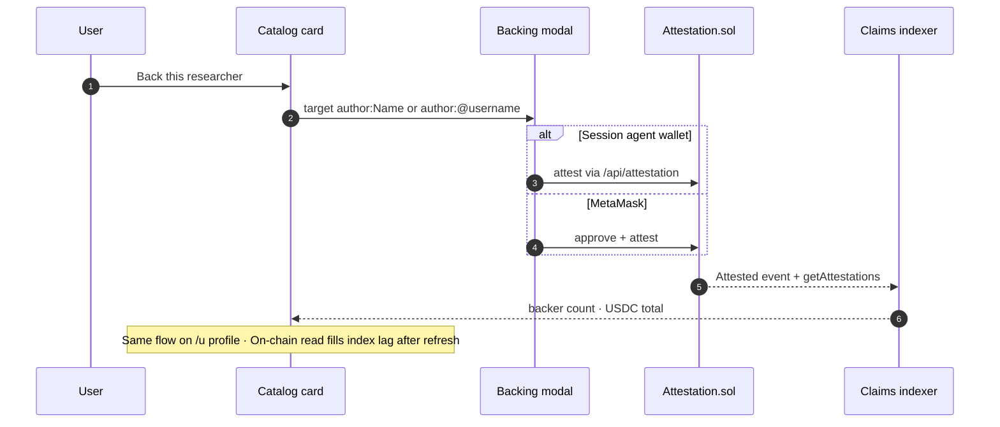

<div align="center">


# Citation Agent

**Researchers sell crypto research. Agents buy it.**

Crypto research marketplace on Arc Testnet: x402 + Circle Gateway USDC unlocks, creator royalties, TrustGate wallet scoring, and on-chain research backing.

[Live demo](https://agentcitation.xyz) · [Demo video](https://youtu.be/hZEROArwU3c) · [Arc Testnet](https://docs.arc.network) · [Circle Gateway](https://developers.circle.com) · [x402](https://www.x402.org)

</div>

---

## Overview

Citation Agent is a crypto research marketplace on **Arc Testnet**. Analysts publish paywalled reports; humans and agents unlock them with **USDC** via **x402** and **Circle Gateway**. Each unlock settles in full to the creator's payout wallet (royalty ledger in Supabase). Optional **TrustGate** wallet scores appear on cards. **Attestation.sol** lets anyone stake USDC behind a report or researcher. Settlement machinery stays visible on the dashboard without dominating the product surface.

| Layer | What users see | What runs underneath |
| --- | --- | --- |
| **Catalog** | Browse, sort, topic filter, unlock, cite | Markdown seeds + Supabase posts |
| **Publish** | Draft anytime · sign once to go live | Local autosave + server drafts + wallet publish sig |
| **Profiles** | `/u/@name` · View → catalog · tip · back · follow | `platform_profiles`, `creator_follows`, tip x402 |
| **Reports** | `/r/{id}` shareable teaser + unlock CTA | Canonical share URL (also catalog deep-link) |
| **Commerce** | Per-report USDC unlock · optional tips | x402 v2, Gateway batch settlement, royalty ledger |
| **Identity** | `@username` on posts, comments, `@mentions` | `platform_profiles` + `profile_wallets` |
| **Discussion** | Threaded comments on unlocked posts | `post_comments`, unlock gate, agent session only |
| **Trust** | Optional score on cards | TrustGate arc-score (free) + paid verify (cached) |
| **Backing** | Stake behind a report or researcher | `Attestation.sol`, on-chain registry |
| **Agents** | CLI research loop · browser agent wallet | Session wallet, WalletConnect, Gateway pay |

Architecture (unlock → payout sequence): [docs/ARCHITECTURE.md](docs/ARCHITECTURE.md)  
Extended product reference: [docs/platform-overview.md](docs/platform-overview.md)

---

## System architecture


```mermaid
flowchart TB
  subgraph Clients["Clients"]
    Human["Human · WalletConnect / MetaMask"]
    Agent["Research agent CLI"]
    BrowserAgent["Browser · session agent wallet"]
  end

  subgraph Application["Application · Next.js"]
    Marketplace["/marketplace · catalog · publish · follow"]
    Profiles["/u/username · tip · back · View"]
    Reports["/r/postId · share landing"]
    Dashboard["/dashboard · settlement machinery"]
    APIs["API routes · x402 · drafts · follow · tip · attest"]
  end

  subgraph Settlement["Settlement · Circle"]
    Facilitator["Batch facilitator"]
    GatewayAPI["Gateway API"]
    Relayer["Relayer"]
  end

  subgraph Chain["Arc Testnet · 5042002"]
    GatewayWallet["Gateway wallet"]
    USDC["USDC"]
    Attestation["Attestation.sol"]
  end

  subgraph Persistence["Persistence"]
    Supabase[("Supabase · posts · drafts · profiles · follows · comments · earnings")]
    Seeds["content/creators/*.md"]
  end

  Human --> Marketplace
  Human --> Profiles
  Human --> Reports
  BrowserAgent --> Marketplace
  Profiles -->|"View · unlock"| Marketplace
  Reports -->|"Unlock CTA"| Marketplace
  Agent --> APIs
  Marketplace --> APIs
  Profiles --> APIs
  Dashboard --> APIs
  APIs --> Facilitator
  Facilitator --> GatewayAPI --> Relayer --> GatewayWallet
  APIs --> Attestation
  Attestation --> USDC
  APIs --> Seeds
  APIs --> Supabase
```

---

## Research unlock flow

Buyers fund a **Gateway balance** first. Unlock debits that balance — not the wallet directly. Agent-wallet unlocks are remembered across refresh via `creator_earnings`; the same browser session also caches bodies in `sessionStorage`.


```mermaid
sequenceDiagram
  autonumber
  participant Buyer as Buyer · agent or MetaMask
  participant UI as Marketplace catalog
  participant API as GET /api/marketplace/citations
  participant Fac as Circle facilitator
  participant GW as Gateway
  participant DB as Supabase

  Buyer->>UI: Unlock report
  UI->>API: GET ?id=listing
  API-->>Buyer: 402 + payment requirements
  Note over Buyer: EIP-712 TransferWithAuthorization
  Buyer->>API: Retry with payment-signature
  API->>Fac: verify and settle
  Fac->>GW: queue batch
  GW-->>API: settlement confirmed
  API->>DB: record creator_earnings
  API-->>Buyer: 200 + citation body
  Note over UI: Re-open catalog · no re-pay for same agent wallet
```

---

## Session agent wallet

Browser buyers use a **session agent wallet** — encrypted in Supabase, bound to an `agent_session` cookie (90-day max, 30-day rotation). Paste a recovery wallet address at **create** (no popup). On another device, click **Connect wallet** (WalletConnect on phone, MetaMask on desktop) and **sign** to restore the same wallet and Gateway balance. The wallet modal never opens on page load — only after you click Connect.


```mermaid
flowchart LR
  subgraph Create["Create · this device"]
    C1["Paste recovery address optional"]
    C2["POST /api/agent-wallet"]
    C1 --> C2
  end

  subgraph Use["Pay · same session"]
    U1["Fund Arc wallet · deposit Gateway"]
    U2["Unlock without MetaMask popups"]
    U1 --> U2
  end

  subgraph Restore["Restore · other device"]
    R1["Connect wallet + sign"]
    R2["POST /api/agent-wallet/recover"]
    R1 --> R2
  end

  C2 --> Use
  Use -.->|new browser / cleared data| R2
  R2 --> Use
```


```mermaid
sequenceDiagram
  autonumber
  participant User
  participant UI as Pay with · Agent wallet
  participant API as Agent wallet API
  participant DB as Supabase

  alt Create new
    User->>UI: Paste recovery address · Create
    UI->>API: POST /api/agent-wallet
    API->>DB: encrypted key + linked_wallet
  else Restore
    User->>UI: Recover · Connect wallet
    UI->>API: POST /api/agent-wallet/recover · signed
    API->>DB: rebind row by linked_wallet
  end
  API-->>User: same agent address · balances intact
```

Setup UI: landing → choose Recover or Create → step 2. Re-tap **Agent wallet** to go back. Full reference: [docs/platform-overview.md](docs/platform-overview.md#session-agent-wallets).

---

## Platform identity and comments

Researchers and readers share one **platform username** (`@name`, 3–24 chars, lowercase). Usernames are chosen on first publish or first comment, linked to the session agent wallet and optionally the publisher wallet. A 7-day cooldown applies between username changes.

Comments are available only on **unlocked** posts. Readers comment via the session agent wallet (no MetaMask popups). Replies are threaded via `parentId`. Type `@username` in comments or teasers to link to that creator’s public profile.


```mermaid
sequenceDiagram
  autonumber
  participant Reader as Reader · agent wallet
  participant UI as Unlocked post · Comments
  participant Profile as Profile API
  participant Comments as Comments API
  participant DB as Supabase

  Reader->>UI: Expand unlocked post
  UI->>Comments: GET ?postId=
  Comments->>DB: post_comments + platform_profiles
  Comments-->>UI: threaded comment list
  alt No username yet
    Reader->>Profile: POST username
    Profile->>DB: platform_profiles + profile_wallets
  end
  Reader->>Comments: POST body · optional parentId · @mentions
  Comments->>DB: verify unlock · insert comment
  Comments-->>UI: 201 + comment
```

---

## Publish and drafts

Creators expand **Publish research** on the marketplace: connect wallet, choose `@username`, write (or **import paste** markdown), **Save draft** anytime, then **Sign and publish** once.

| Layer | Behavior |
| --- | --- |
| Local autosave | `localStorage` per connected wallet while typing (no signature) |
| Server draft | `POST /api/marketplace/drafts` · my-posts signature · `status = draft` |
| Live post | Publish payload signature · `status = published` · share link `/r/{id}` |


```mermaid
flowchart LR
  Write["Write / import paste"] --> Local["Local autosave"]
  Local --> Draft["Save draft · server"]
  Draft --> Sign["Sign and publish"]
  Sign --> Live["Catalog + /r/id"]
  Live --> Share["Share /u and /r links"]
```

---

## Public profiles, follow, and tips

| Surface | Purpose |
| --- | --- |
| `/u/{username}` | Creator desk: stats, all published reports, follow, tip, back |
| Report cards on profile | Teaser only · **View** opens catalog deep-link for unlock/read |
| Hero **Follow** | Discover publishers who have at least one live report |
| Following panel | Feed of posts from desks you follow (marketplace, below catalog) |
| Tip | USDC via Gateway to the creator’s payout wallet |
| Back researcher | Same on-chain stake flow as catalog (`author:@name`) |


```mermaid
flowchart TB
  subgraph Discover["Discover"]
    Hero["Hero · Follow"]
    Recs["Recommendations · published only"]
    Hero --> Recs
  end

  subgraph Profile["/u/username"]
    Stats["Reports · readers · followers"]
    Tip["Tip USDC"]
    Back["Back researcher"]
    Cards["Report teasers"]
    Stats --> Tip
    Stats --> Back
    Stats --> Cards
  end

  subgraph Read["Read · marketplace"]
    View["View → /marketplace?post=id"]
    Unlock["Unlock body · comments"]
    View --> Unlock
  end

  Recs -->|"Follow + open profile"| Profile
  Cards --> View
```


```mermaid
sequenceDiagram
  autonumber
  participant User
  participant Profile as /u/username
  participant Tip as GET /api/marketplace/tip
  participant Fac as Circle facilitator
  participant Creator as Creator payout wallet

  User->>Profile: Tip amount · agent Gateway
  Profile->>Tip: x402 pay username + amount
  Tip-->>User: 402 requirements · payTo = creator
  User->>Tip: payment-signature
  Tip->>Fac: verify and settle
  Fac-->>Creator: USDC tip
  Tip-->>User: 200 tip receipt
```

---

## Research backing and reputation

Backing is framed as commerce copy on catalog cards (`Back this research` / `Back this researcher`). Stakes are public on-chain claims grouped by canonical target (`author:…`, `citation:…`). Reputation is optional per card — free badge when configured, paid verify when the user opts in.


```mermaid
sequenceDiagram
  autonumber
  participant User
  participant Card as Catalog card
  participant Modal as Backing modal
  participant Chain as Attestation.sol
  participant Index as Claims indexer

  User->>Card: Back this researcher
  Card->>Modal: target author:Name or author:@username
  alt Session agent wallet
    Modal->>Chain: attest via /api/attestation
  else MetaMask
    Modal->>Chain: approve + attest
  end
  Chain-->>Index: Attested event + getAttestations
  Index-->>Card: backer count · USDC total
  Note over Card: Same flow on /u profile · On-chain read fills index lag after refresh
```

---

## Stack

| Layer | Technology |
| --- | --- |
| Application | Next.js 16, React 19, Tailwind CSS, shadcn/ui |
| Payments | x402 v2, Circle Gateway, viem |
| Attestations | Solidity, Foundry, Arc USDC |
| Chain | Arc Testnet (5042002) |
| Data | Supabase Postgres (publish, royalties, agent wallets, paid trust cache) |
| Deploy | Vercel |

---

## Quick start

**Prerequisites:** Node.js 22+, Arc Testnet USDC ([Circle faucet](https://faucet.circle.com/))

```cmd
git clone https://github.com/rudazy/citation-agent.git
cd citation-agent
npm install
copy .env.example .env.local
npm run generate-wallets
```

Edit `.env.local` with real values. **Never commit `.env.local` or any `*_PRIVATE_KEY`.** If a private key is exposed, rotate it immediately.

### Minimum env (local UI + x402 unlock against seed catalog)

| Variable | Why |
| --- | --- |
| `SELLER_ADDRESS` / `SELLER_PRIVATE_KEY` | x402 payee for legacy seeds; withdrawals |
| `BUYER_ADDRESS` / `BUYER_PRIVATE_KEY` | CLI funder / smoke tests only |
| `AGENT_WALLET_ENCRYPTION_KEY` | Encrypts in-app session agent wallets (32+ chars) |
| `ARC_TESTNET_RPC` | Arc Testnet RPC |
| `ATTESTATION_*` / `NEXT_PUBLIC_ATTESTATION_ADDRESS` | Backing flows (optional for unlock-only) |
| `NEXT_PUBLIC_SITE_URL` / `BASE_URL` | `http://localhost:3000` locally |
| `NEXT_PUBLIC_WALLETCONNECT_PROJECT_ID` | Mobile WalletConnect (optional on desktop MetaMask) |

### Full marketplace (publish, royalties UI, agent restore, comments)

Also set Supabase URL + anon/publishable key + **`SUPABASE_SERVICE_ROLE_KEY`** (never commit), then apply migrations in `supabase/migrations/` (agent wallets, publish, usernames, comments, drafts, follows). Per file:

```cmd
npx tsx scripts/apply-sql-migration.mts supabase/migrations/<migration>.sql
```

Optional TrustGate badges: append vars from [`.env.local.example`](.env.local.example) into `.env.local`.

Script-only keys (documented in `.env.example` with never-commit warnings): `DEPLOYER_PRIVATE_KEY`, `PUBLISHER_PRIVATE_KEY`.

```cmd
npm run dev
```

Open [http://localhost:3000](http://localhost:3000). Create a session agent wallet, fund it from the faucet, deposit to Gateway, then unlock a catalog report.

| Route | Purpose |
| --- | --- |
| `/` | Redirects to `/marketplace` |
| `/marketplace` | Catalog, publish/drafts, follow discovery, following feed, unlock |
| `/u/{username}` | Public creator profile · View → catalog · tip · back · follow |
| `/r/{postId}` | Shareable report teaser · unlock CTA into catalog |
| `/dashboard` | Payments, royalties, withdrawals, operator fees, settlement trace |

**Research agent**

```cmd
npm run agent -- "Hyperliquid market structure"
npm run agent -- "stablecoin yield" --min-trust 50
```

**Operator scripts** (dev server + env required)

```cmd
npx tsx scripts/generate-research-seeds.mts
npx tsx scripts/publish-research-posts.mts
npx tsx scripts/archive-catalog-noise.mts
```

**Smoke tests**

```cmd
npm run smoke:marketplace
npm run smoke:marketplace:full
```

Unit tests (no live keys required for the default suite):

```cmd
npm run test
```

---

## API summary

### Marketplace

| Endpoint | Auth | Notes |
| --- | --- | --- |
| `GET /api/marketplace/citations` | Public | Catalog metadata, backing stats, prior unlocks for session agent |
| `GET /api/marketplace/citations?id=` | x402 | Unlock body; records earnings |
| `GET /api/marketplace/citations?refresh=1` | Public | Bust attestation cache after new backing |
| `POST /api/marketplace/citations` | Wallet signature | Publish a post (requires `@username`) |
| `GET /api/marketplace/drafts` | my-posts signature | List server drafts for connected wallet |
| `POST /api/marketplace/drafts` | my-posts signature | Create/update draft (`status = draft`) |
| `DELETE /api/marketplace/drafts?id=` | my-posts signature | Delete a draft |
| `GET /api/marketplace/comments?postId=` | Public | Threaded comments for a post |
| `POST /api/marketplace/comments` | Session agent | Comment or reply (unlock required); `@mentions` supported in body |
| `GET /api/marketplace/tip?username=&amount=` | x402 | Tip USDC to creator payout wallet |
| `GET /api/marketplace/follow` | Session + username | List followed creators |
| `POST /api/marketplace/follow` | Session + username | Follow a publisher `@username` |
| `DELETE /api/marketplace/follow?username=` | Session + username | Unfollow |
| `GET /api/marketplace/follow/recommendations` | Session | Publishers with ≥1 published report |
| `GET /api/marketplace/following/feed` | Session | Recent posts from followed creators |
| `GET /api/marketplace/profiles/{username}` | Public | Public profile metadata + report teasers |

### Profile

| Endpoint | Auth | Notes |
| --- | --- | --- |
| `GET /api/profile` | Session | Current username, change cooldown, agent status |
| `GET /api/profile?publisher=` | Session | Resolve profile across agent + publisher wallets |
| `POST /api/profile` | Session agent | Set or change username; optional `publisherAddress` link |

### Gateway and agent wallet

| Endpoint | Auth | Notes |
| --- | --- | --- |
| `POST /api/gateway/deposit` | Session agent | Deposit USDC into Gateway |
| `POST /api/gateway/pay` | Session agent | Pay allowlisted x402 paths |
| `GET /api/agent-wallet` | Session | Status, balances, linked recovery address |
| `POST /api/agent-wallet` | Session | Provision wallet; optional `{ recoveryWallet }` at create |
| `POST /api/agent-wallet/link` | Session | Paste or signed link to set/verify recovery address |
| `GET /api/agent-wallet/recoverable?address=` | Public | Check if address has a linked agent wallet |
| `POST /api/agent-wallet/recover` | Wallet sign | Restore wallet on new device by linked address |

### Trust and backing

| Endpoint | Auth | Notes |
| --- | --- | --- |
| `GET /api/trustgate/score?postId=` | Public | Free or cached score |
| `POST /api/trustgate/score` | Payment proof | Paid verify; Supabase-backed cache |
| `POST /api/attestation` | Session agent | Server-side stake |
| `GET /api/attestation/claims` | Public | Registry; `?refresh=1` busts cache |

Catalog merges **markdown seeds** (`content/creators/`) and **Supabase posts** (`creator_posts`). Markdown seeds resolve trust identity to `NEXT_PUBLIC_OPERATOR_ADDRESS` unless `MARKETPLACE_IDENTITY_WALLET` is set.

---

## Environment

1. Copy [`.env.example`](.env.example) → `.env.local`.
2. Optionally append TrustGate keys from [`.env.local.example`](.env.local.example).
3. Run `npm run generate-wallets` if you need new seller/buyer pairs.

**Never commit** real `*_PRIVATE_KEY`, `SUPABASE_SERVICE_ROLE_KEY`, or `AGENT_WALLET_ENCRYPTION_KEY` values. Placeholders in the examples are not credentials. If a key leaks, rotate it and treat any funded wallet as compromised.

| Variable | Purpose |
| --- | --- |
| `SELLER_ADDRESS` / `SELLER_PRIVATE_KEY` | Platform x402 payee; legacy seed fallback |
| `BUYER_ADDRESS` / `BUYER_PRIVATE_KEY` | CLI funder (`npm run agent`, `npm run attest`) |
| `DEPLOYER_PRIVATE_KEY` | Script-only attestation deploy; falls back to `BUYER_PRIVATE_KEY`. **Never commit.** |
| `PUBLISHER_PRIVATE_KEY` | Script-only seed publisher. **Never commit.** |
| `DEPOSIT_AMOUNT` | Optional CLI Gateway deposit size (default `1`) |
| `ATTESTATION_ADDRESS` / `NEXT_PUBLIC_ATTESTATION_ADDRESS` | `Attestation.sol` |
| `ATTESTATION_DEPLOY_BLOCK` | Event indexer start block |
| `NEXT_PUBLIC_OPERATOR_ADDRESS` | Platform fee recipient; markdown seed trust identity |
| `ARC_TESTNET_RPC` / `NEXT_PUBLIC_ARC_TESTNET_RPC` | Server / client RPC (public Arc default if unset) |
| `GATEWAY_API` | Circle Gateway API |
| `AGENT_WALLET_ENCRYPTION_KEY` | Encrypts per-session agent keys (32+ chars); keep stable across deploys |
| `NEXT_PUBLIC_SITE_URL` / `BASE_URL` | Official origin (`https://agentcitation.xyz` in production) |
| `NEXT_PUBLIC_WALLETCONNECT_PROJECT_ID` | Reown AppKit / WalletConnect; allowlist origin in [dashboard.reown.com](https://dashboard.reown.com) |
| Supabase URL, anon key, `SUPABASE_SERVICE_ROLE_KEY` | Publish, drafts, profiles, follows, comments, tips ledger, agent wallets |

**TrustGate (optional)** — full key list in `.env.local.example`

| Variable | Purpose |
| --- | --- |
| `TRUSTGATE_SCORE_API_URL` | Free reader — `https://www.trustgated.xyz/api/arc-score/{address}` |
| `TRUSTGATE_ORACLE_URL` | Paid verify — `https://www.trustgated.xyz/api/oracle/{address}` (not a direct oracle host) |
| `SCORING_WALLET_*` (full set) | Wallet-rescore caps — **required for accurate badges** |
| `TRUSTGATE_TIMEOUT_MS` | Upstream arc-score timeout (default `12000` ms) |
| `TRUSTGATE_PAID_CACHE_TTL_MS` | Paid score cache TTL (Supabase + memory) |

---

## Deployed contracts (Arc Testnet)

| Contract | Address |
| --- | --- |
| Attestation | `0xc8886a68f2160a57a01b32aae542b6eec5ca3d02` |
| USDC | `0x3600000000000000000000000000000000000000` |
| Gateway wallet | `0x0077777d7EBA4688BDeF3E311b846F25870A19B9` |

Indexer start block: `48323587` (override with `ATTESTATION_DEPLOY_BLOCK` if redeployed).

[Attestation verified on Arcscan](https://testnet.arcscan.app/address/0xc8886a68f2160a57a01b32aae542b6eec5ca3d02#code)

---

## Deploy

1. Connect the repository to [Vercel](https://vercel.com).
2. Set environment variables from `.env.example`.
3. Apply Supabase migrations on the production project.
4. Deploy from `main`.

Post-deploy: confirm [https://agentcitation.xyz/llms.txt](https://agentcitation.xyz/llms.txt) is reachable and the marketplace catalog loads with research listings.

---

## Security

- **Testnet only.** Do not reuse generated keys on mainnet.
- Private keys remain server-side; never expose them to the client.
- Never commit `.env.local` or real private keys. See [`SECURITY.md`](SECURITY.md) for reporting.

---

## License

Apache-2.0. Portions derived from the [arc-nanopayments](https://github.com/circlefin/arc-nanopayments) starter (Circle Internet Group, Inc.).