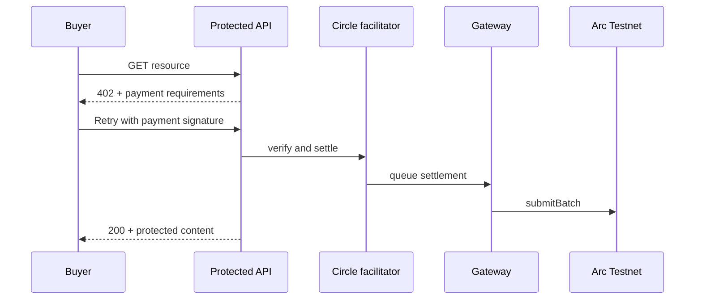

# Citation Agent — Platform Overview

Live site: [https://agentcitation.xyz](https://agentcitation.xyz)

Citation Agent is a reference application for **agentic commerce over paywalled knowledge**. It demonstrates how research agents and human users can discover citations, pay creators per unlock, settle through Circle Gateway on Arc Testnet, and stake USDC behind public trust claims.

The stack is intentionally production-shaped: typed APIs, server-held paywalled content, encrypted session wallets, optional Postgres persistence, and on-chain attestation records. Everything runs on **Arc Testnet (chain ID 5042002)** using testnet USDC.

---

## Who this is for

| Audience | What you get |
| --- | --- |
| **Product and engineering** | A working model of x402 paywalls, royalty accounting, and trust signals wired into a real UI |
| **Agent builders** | HTTP endpoints and a CLI that pay for citations programmatically |
| **Creators** | A publish flow that stores paid posts server-side and exposes a public catalog without leaking bodies or wallets |
| **Operators** | A dashboard for settlements, royalties, withdrawals, and platform attestation fees |

---

## Core concepts

### Pay-per-citation

Creator content is split into a **public teaser** (title, subheading, price, tags) and a **paid body**. The body is never returned until the buyer completes an x402 payment. Each successful unlock settles in full to the creator's payout wallet and records a creator-earnings ledger entry for that amount.

Content comes from two sources, merged into one catalog:

1. **Seed markdown** in `content/creators/` (static, version-controlled)
2. **Published posts** in Supabase `creator_posts` (wallet-signed publish from the UI)

### x402 and Circle Gateway

Protected routes return **HTTP 402** with payment requirements. The buyer signs an **EIP-712 TransferWithAuthorization**; Circle's facilitator verifies and queues settlement. Funds move from the buyer's **Gateway balance**, not directly from the wallet on each request.

Typical flow:



Unlock payments settle directly to the post's `payout_wallet` (which defaults to the creator's connected wallet at publish), and the full amount goes to the creator. Legacy markdown seed posts that never set a payout wallet fall back to `SELLER_ADDRESS` (the platform operator wallet). Platform revenue comes from attestation fees, not from an unlock split.

### USDC attestations

Anyone can stake USDC on `Attestation.sol` to back a public claim about a **target** (X handle, wallet, URL, agent ID, etc.). Each attestation requires:

- Minimum stake: **0.1 USDC**
- Platform fee: **0.1 USDC** (sent to the immutable `platformFeeRecipient`)

Claims are indexed from on-chain `Attested` events and shown in a public registry. Stakers' TrustGate scores can weight how stake is displayed in aggregate views.

### TrustGate scores

Optional behavioral trust scores enrich citation cards, the claims registry, and the research CLI. Two modes exist:

| Mode | Config | Behavior |
| --- | --- | --- |
| **Free reader** | `TRUSTGATE_SCORE_API_URL` | Server fetches scores; missing config or 402 responses degrade to no badge |
| **Paid oracle** | `TRUSTGATE_ORACLE_URL` | User-initiated lookup (0.001 USDC); resolved by `postId` so author wallets stay hidden |

Scores are cached in memory with a configurable TTL. A second lookup for the same target does not charge again while cached.

### Session agent wallets

Each browser gets a persistent **agent wallet** tied to an `agent_session` cookie. Private keys are encrypted in Supabase (`user_agent_wallets`). These wallets are used for Gateway deposits, in-app payments, server-side attestations, and paid trust refresh — separate from the CLI funder wallet (`BUYER_PRIVATE_KEY`).

---

## Application surfaces

### Marketplace (`/marketplace`)

The public demo page. Sections, top to bottom:

1. **Hero** — product positioning
2. **Publish** — connect MetaMask, sign `"Citation Agent publish {timestamp}"`, submit title/subheading/body/price/tags; minimum price 0.001 USDC
3. **Buyer demo** — pay `$0.01` hello-world via agent wallet or MetaMask; fund and deposit to Gateway
4. **Citation catalog** — browse listings, expand to unlock (x402), refresh trust, attest about an author
5. **Claims registry** — browse on-chain attestations by target
6. **Payment trace** — inspect a settlement UUID through facilitator queue to on-chain batch

### Dashboard (`/dashboard`)

Operator and analytics view. Tabs:

| Tab | Data source | Purpose |
| --- | --- | --- |
| Payments | `payment_events` | Realtime x402 settlements (endpoint, payer, amount, memo, gateway tx) |
| Creators | `creator_earnings` | Per-citation royalty ledger |
| Agents | `agent_reputation` | Cumulative spend and citation count per payer wallet |
| Attest fees | `attestation_platform_fees` | Platform fee from attestations (**operator wallet only**) |
| Your withdrawals | `withdrawals` | Gateway withdrawal history (seller or agent scope) |
| Claims | On-chain indexer | Same attestation registry as marketplace |
| Payment trace | Circle Gateway API | Settlement lifecycle decoder |

Without Supabase, the UI still loads but payment and royalty tables stay empty; a setup banner explains what is missing.

The root path `/` redirects to `/dashboard`.

---

## API reference

### Marketplace and citations

| Method | Path | Auth | Description |
| --- | --- | --- | --- |
| GET | `/api/marketplace/citations` | Public | Catalog (no body, no wallets) |
| GET | `/api/marketplace/citations?id=` | x402 | Unlock citation body; records royalty |
| POST | `/api/marketplace/citations` | Wallet signature | Publish a new post |
| GET | `/api/marketplace/hello` | x402 ($0.01) | Hello-world paid resource |
| GET | `/api/marketplace/settlement/:id` | Public | Gateway transfer status (proxy) |
| GET | `/api/marketplace/batch-tx/:id` | Public | Resolve settlement to batch transaction |
| GET | `/api/marketplace/decode-batch/:hash` | Public | Decode `submitBatch` calldata |
| GET | `/api/marketplace/gateway-balance?address=` | Public | Gateway USDC balance for an address |

### Premium endpoints (agent / load-test)

| Method | Path | Price | Description |
| --- | --- | --- | --- |
| GET | `/api/premium/citation/index` | Free | Citation catalog for agents |
| GET | `/api/premium/citation?id=` | Per listing | Paid citation unlock |
| GET | `/api/premium/quote` | $0.001 | Random quote |
| GET | `/api/premium/dataset` | $0.01 | Sample metrics |
| POST | `/api/premium/compute` | $0.0003 | Text statistics |
| GET | `/api/premium/agent-task` | Paid | Random clue (demo task) |

### Gateway and agent wallet

| Method | Path | Auth | Description |
| --- | --- | --- | --- |
| POST | `/api/gateway/deposit` | Session agent | Deposit agent USDC into Gateway |
| POST | `/api/gateway/pay` | Session agent | Pay an allowlisted x402 path server-side |
| GET | `/api/gateway/balance` | Operator signature | Seller Gateway and wallet balances |
| POST | `/api/gateway/withdraw` | Operator or session | Withdraw Gateway funds |
| GET | `/api/gateway/withdrawals?scope=` | Public | Withdrawal history (`seller` or `agent`) |
| GET | `/api/agent-wallet` | Session | Agent wallet status |
| POST | `/api/agent-wallet` | Session | Provision agent wallet |

### Attestations

| Method | Path | Auth | Description |
| --- | --- | --- | --- |
| POST | `/api/attestation` | Session agent | Submit attestation on-chain |
| GET | `/api/attestation/claims` | Public | All targets and totals |
| GET | `/api/attestation/claims?target=` | Public | Claims for one target |
| POST | `/api/attestation/fee` | Public | Verify attest tx and record platform fee |
| GET | `/api/attestation/fees` | Operator signature | Platform fee ledger |

### TrustGate

| Method | Path | Auth | Description |
| --- | --- | --- | --- |
| GET | `/api/trustgate/score?postId=` | Public | Cached score or 402 challenge |
| POST | `/api/trustgate/score` | Payment proof | Settle paid lookup |
| POST | `/api/trustgate/score/agent` | Session agent | Agent wallet pays oracle fee |

### Operations

| Method | Path | Description |
| --- | --- | --- |
| GET | `/api/dashboard/health` | Supabase, seller, attestation, and trust readiness flags |

---

## Command-line tools

### Research agent

```cmd
npm run agent -- "How do nanopayments enable trust infrastructure?"
```

The agent searches the citation catalog, optionally filters by TrustGate score, funds an ephemeral wallet from `BUYER_PRIVATE_KEY`, deposits to Gateway, pays for each citation, and prints a ranked synthesis with attribution.

| Flag | Effect |
| --- | --- |
| `--min-trust <n>` | Skip sources below score threshold (default: cite everyone) |
| `--strict-unscored` | Also skip unscored sources when gate is active |
| `--limit <usdc>` | Load-test mode: cap spend across premium endpoints |

### Other scripts

| Command | Purpose |
| --- | --- |
| `npm run generate-wallets` | Generate seller and buyer keys in `.env.local` |
| `npm run attest <target> "<claim>" <stake>` | CLI attestation with buyer wallet |
| `npm run canteen wrap/unwrap/balance` | CanteenUSDC wrapper operations |
| `npm run deploy:attestation` | Deploy `Attestation.sol` |
| `npm run smoke:marketplace` | End-to-end smoke (no on-chain spend) |
| `npm run smoke:marketplace:full` | Smoke with publish and paid unlock |

---

## Data model

Supabase is optional for local UI exploration but required for publish, realtime dashboard, and royalty tracking.

| Table | Role |
| --- | --- |
| `payment_events` | Append-only x402 settlement log |
| `creator_earnings` | Per-unlock royalty records (full amount to creator payout wallet) |
| `agent_reputation` | Payer spend totals and citation counts |
| `creator_posts` | Published marketplace content (service-role access only) |
| `user_agent_wallets` | Encrypted per-session agent private keys |
| `attestation_platform_fees` | On-chain attest platform fee audit trail |
| `withdrawals` | Gateway withdrawal records (scoped by wallet and role) |

Row-level security allows public read on settlement and royalty tables. `creator_posts` and `user_agent_wallets` are service-role only so bodies and keys never reach the browser directly.

---

## Smart contracts

| Contract | Purpose |
| --- | --- |
| `Attestation.sol` | USDC-staked claims with flat platform fee |
| `CanteenUSDC.sol` | Optional USDC wrapper for royalty reserves |

Arc Testnet USDC: `0x3600000000000000000000000000000000000000`

Set `ATTESTATION_ADDRESS`, `NEXT_PUBLIC_ATTESTATION_ADDRESS`, and `ATTESTATION_DEPLOY_BLOCK` after deployment. The indexer reads `Attested` events from the deploy block forward.

---

## Operator access

The **operator wallet** (`NEXT_PUBLIC_OPERATOR_ADDRESS`) is the Attestation contract's `platformFeeRecipient`. It gates:

- Dashboard **Attest fees** tab
- `GET /api/gateway/balance`
- Seller-role `POST /api/gateway/withdraw`
- `GET /api/attestation/fees`

Authorization uses a signed message: `"TrustGate operator access {timestamp}"`, verified server-side with a 15-minute window and one-time signature consumption (replay dedup in Supabase).

Creator publish signs `"Citation Agent publish {timestamp} {payloadDigest}"` where `payloadDigest` is a keccak256 hash of the canonical publish JSON — the body cannot be swapped after signing.

Browser agent wallets bind to an `agent_session` cookie that rotates every 24 hours (7-day max age) and immediately after wallet provisioning.

---

## Environment

Copy `.env.example` to `.env.local`. Minimum for marketplace and attestations:

| Variable | Purpose |
| --- | --- |
| `SELLER_ADDRESS` / `SELLER_PRIVATE_KEY` | x402 payee and operator withdrawals |
| `BUYER_ADDRESS` / `BUYER_PRIVATE_KEY` | CLI funder and `npm run attest` |
| `ATTESTATION_ADDRESS` / `NEXT_PUBLIC_ATTESTATION_ADDRESS` | Attestation contract |
| `ATTESTATION_DEPLOY_BLOCK` | Event indexer start block |
| `ARC_TESTNET_RPC` | Arc JSON-RPC |
| `GATEWAY_API` | Circle Gateway facilitator |
| `AGENT_WALLET_ENCRYPTION_KEY` | Encrypts session agent keys (32+ chars) |

For publish and dashboard persistence, add Supabase URL, anon key, and service role key. See `.env.local.example` for TrustGate and operator variables.

---

## Verification

| Check | Command or URL |
| --- | --- |
| Unit tests | `npm test` |
| Marketplace tests | `npm run test:marketplace` |
| Smoke (local dev server required) | `npm run smoke:marketplace` |
| Health | `GET /api/dashboard/health` |
| AI discoverability | `/llms.txt` |

---

## Known scope boundaries

These are intentional gaps in the current reference, not oversights:

- **TrustGate** — fully optional; the app runs without scores
- **Supabase** — optional for read-only exploration; required for publish and realtime dashboard
- **Testnet only** — do not reuse generated keys on mainnet

For setup steps and quick start, see the [README](../README.md).