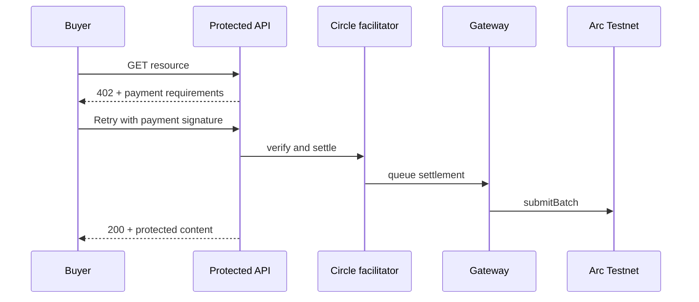
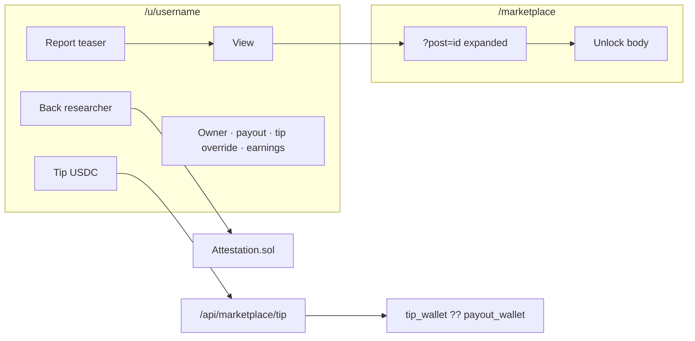
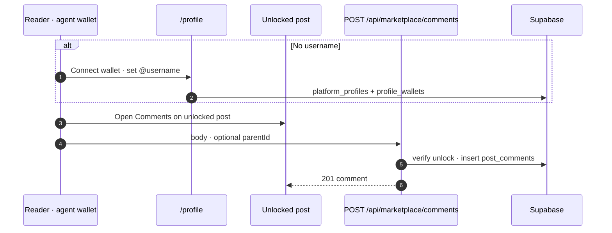
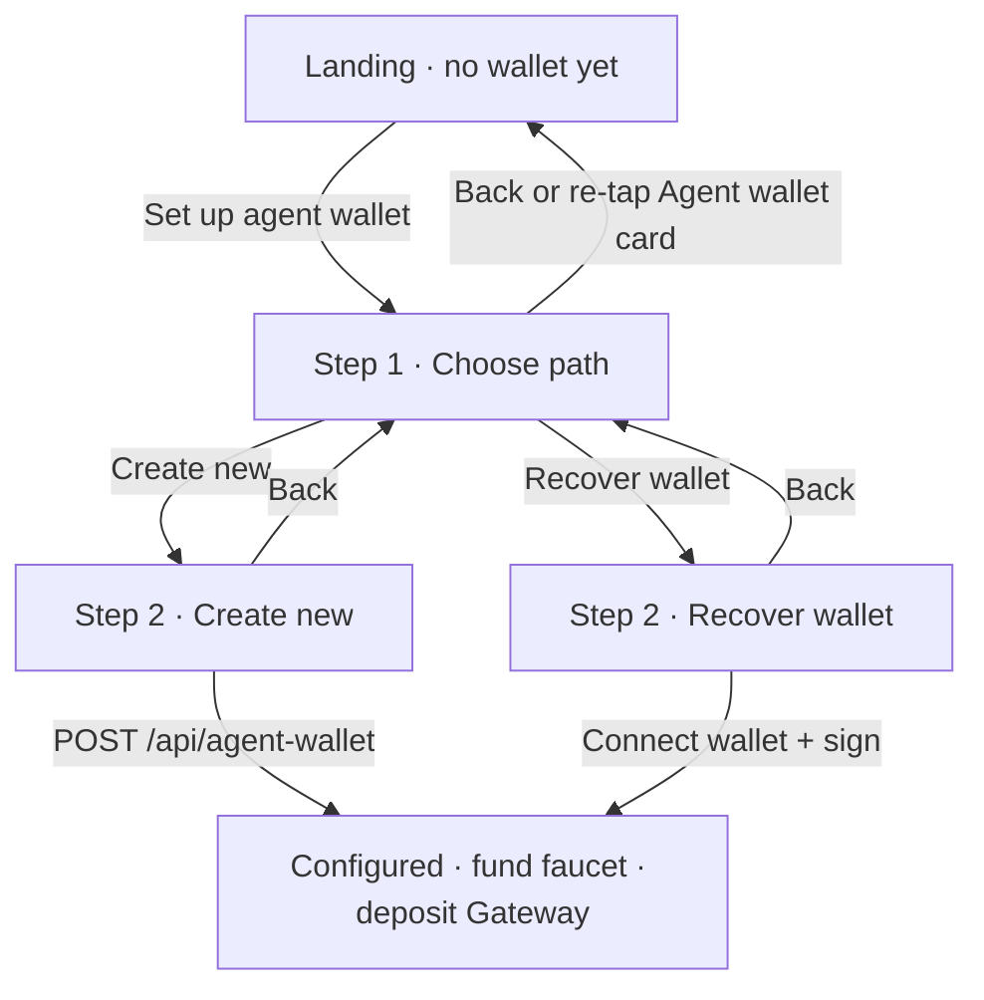
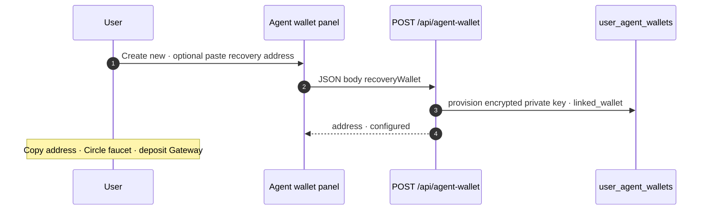
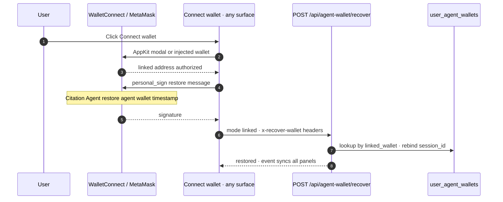
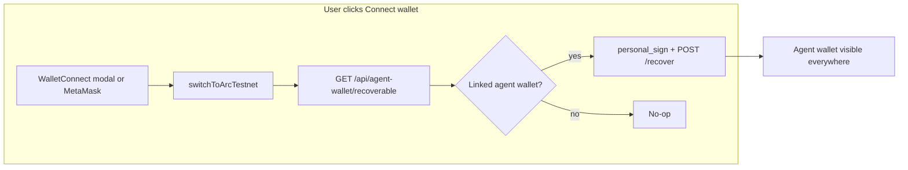

# Citation Agent — Platform Overview

Live site: [https://agentcitation.xyz](https://agentcitation.xyz)  
Architecture (unlock → payout): [ARCHITECTURE.md](./ARCHITECTURE.md)

Citation Agent is a reference application for **agentic commerce over paywalled knowledge**. It demonstrates how research agents and human users can discover citations, pay creators per unlock, settle through Circle Gateway on Arc Testnet, and stake USDC behind public trust claims.

The stack is intentionally production-shaped: typed APIs, server-held paywalled content, encrypted session wallets, optional Postgres persistence, and on-chain attestation records. Everything runs on **Arc Testnet (chain ID 5042002)** using testnet USDC.

---

## Who this is for

| Audience | What you get |
| --- | --- |
| **Product and engineering** | A working model of x402 paywalls, royalty accounting, and trust signals wired into a real UI |
| **Agent builders** | HTTP endpoints and a CLI that pay for citations programmatically |
| **Creators** | A publish flow that stores paid posts server-side and exposes a public catalog without leaking bodies or wallets |
| **Operators** | A dashboard for settlements, royalties, withdrawals, and platform attestation fees |

---

## Core concepts

### Pay-per-citation

Creator content is split into a **public teaser** (title, subheading, price, tags) and a **paid body**. The body is never returned until the buyer completes an x402 payment. Each successful unlock settles in full to the creator's payout wallet and records a creator-earnings ledger entry for that amount.

Content comes from two sources, merged into one catalog:

1. **Seed markdown** in `content/creators/` (static, version-controlled)
2. **Published posts** in Supabase `creator_posts` (wallet-signed publish from the UI)

### x402 and Circle Gateway

Protected routes return **HTTP 402** with payment requirements. The buyer signs an **EIP-712 TransferWithAuthorization**; Circle's facilitator verifies and queues settlement. Funds move from the buyer's **Gateway balance**, not directly from the wallet on each request.

Typical flow:


```mermaid
sequenceDiagram
  participant Buyer
  participant API as Protected API
  participant Fac as Circle facilitator
  participant GW as Gateway
  participant Chain as Arc Testnet

  Buyer->>API: GET resource
  API-->>Buyer: 402 + payment requirements
  Buyer->>API: Retry with payment signature
  API->>Fac: verify and settle
  Fac->>GW: queue settlement
  GW->>Chain: submitBatch
  API-->>Buyer: 200 + protected content
```

Unlock payments settle directly to the post's `payout_wallet`. The publish form has no wallet field: the profile default is used; on a first publish with nothing stored, the signing wallet silently becomes the default. Legacy markdown seed posts that never set a payout wallet fall back to `SELLER_ADDRESS` (the platform operator wallet). The full unlock amount goes to the creator. Platform revenue comes from attestation fees, not from an unlock split.

### USDC attestations

Anyone can stake USDC on `Attestation.sol` to back a public claim about a **target** (X handle, wallet, URL, agent ID, report id, etc.). Each attestation requires:

- Minimum stake: **0.1 USDC**
- Platform fee: **0.1 USDC** (sent to the immutable `platformFeeRecipient`)

**Claims registry** is Arcscan-first (`account/txlist` for attest txs), with contract reads / cache for enrichment. Public Arc `eth_getLogs` is treated as unreliable under rate limits. Session **agent wallet** stakes use `POST /api/attestation` with a multi-endpoint RPC transport (primary + public fallbacks). If the API returns rate-limited **before** the tx is broadcast, nothing was staked and a retry is safe. Stakers' TrustGate scores can weight how stake is displayed in aggregate views.

### TrustGate scores

Optional behavioral trust scores enrich citation cards, the claims registry, and the research CLI. Two modes exist:

| Mode | Config | Behavior |
| --- | --- | --- |
| **Free reader** | `TRUSTGATE_SCORE_API_URL` | Server fetches scores; missing config or 402 responses degrade to no badge |
| **Paid oracle** | `TRUSTGATE_ORACLE_URL` | User-initiated lookup (0.001 USDC); resolved by `postId` so author wallets stay hidden |

Scores are cached in memory with a configurable TTL. A second lookup for the same target does not charge again while cached.

### Platform usernames

Researchers and readers share a single **platform username** displayed as `@name` on catalog cards and comments. Rules:

| Rule | Detail |
| --- | --- |
| Format | 3–24 chars, lowercase letters, numbers, underscores |
| Uniqueness | One username globally; API returns 409 on collision |
| Linking | `profile_wallets` maps agent wallet (`agent`) and publisher wallet (`publisher`) to one profile |
| Change cooldown | 7 days between username changes (UI shows remaining time) |
| Account setup | **`/profile`** — connect wallet, choose username, optional signature defaults payout wallet to signer |
| Header | **Profile** → `/profile` when unset, `/u/{you}` when ready |
| Publish | Wallet-signed publish requires a username; stored as `author_name` on `creator_posts` |
| Comments | Session agent wallet only; unlock required; username via `/profile` if not set |
| Public profile | `/u/{username}` — stats, report teasers, follow, tip, back + backer count/USDC |
| Owner settings | Payout wallet, optional tip override, unlock earnings, verification |
| Profile read path | **View** opens `/marketplace?post=` for unlock/read (no full body on profile) |
| Researcher backing | Profile loads `author:{username}` stake summary (backers · USDC) |
| Shareable report | `/r/{postId}` — teaser landing + unlock CTA (canonical share URL) |
| Mentions | `@username` in comments/teasers links to `/u/{username}` |
| Import paste | Publish panel: paste markdown → title / teaser / body |

### Drafts

Creators can stage research before signing:

| Layer | Behavior |
| --- | --- |
| Local autosave | Browser `localStorage` per connected wallet while typing |
| Server draft | `POST /api/marketplace/drafts` with my-posts signature; `creator_posts.status = draft` |
| Publish | Still requires publish payload signature; live posts use `status = published` |
| Author name | Stored lowercase; profile loads posts case-insensitively + by linked wallets |

### Follow + following feed

| Rule | Detail |
| --- | --- |
| Identity | Follower must have a platform username (agent session) |
| Storage | `creator_follows` (follower profile → creator profile) |
| Discovery | Hero **Follow** → recommendations only for accounts with ≥1 published post |
| Feed | `GET /api/marketplace/following/feed` — recent posts from followed creators |
| UI | Follow on profile/report; discover on hero; Following panel below catalog |

### Tips

| Rule | Detail |
| --- | --- |
| Endpoint | `GET /api/marketplace/tip?username=&amount=` (x402) |
| Payee | Optional **tip wallet** override if set; else profile **payout wallet**; else latest post `payout_wallet`; else publisher wallet on the profile |
| Client | Agent Gateway via `POST /api/gateway/pay` |
| Range | 0.001–1000 USDC |
| Profile UI | Tip presets + custom amount; hidden on own profile |
| Owner config | Settings: “Use a different wallet for tips” → `POST /api/profile/tip-wallet` (null clears) |


```mermaid
flowchart LR
  subgraph ProfilePage["/u/username"]
    Teaser["Report teaser"]
    ViewBtn["View"]
    TipBtn["Tip USDC"]
    BackBtn["Back researcher"]
    Settings["Owner · payout · tip override · earnings"]
  end
  subgraph Catalog["/marketplace"]
    Deep["?post=id expanded"]
    Unlock["Unlock body"]
  end
  Teaser --> ViewBtn --> Deep --> Unlock
  TipBtn --> TipAPI["/api/marketplace/tip"]
  TipAPI --> Payee["tip_wallet ?? payout_wallet"]
  BackBtn --> Attest["Attestation.sol"]
```

### Post comments

Unlocked buyers can comment on expanded posts. Comments are stored in `post_comments` with optional `parent_id` for threaded replies.

| Requirement | Detail |
| --- | --- |
| Unlock gate | Agent wallet must have a `creator_earnings` unlock for the post |
| Auth | Session agent wallet (auto-provisioned if missing) |
| Rate limit | 20 comments per minute per agent address |
| Visibility | `GET /api/marketplace/comments?postId=` is public; bodies require no auth |


```mermaid
sequenceDiagram
  autonumber
  participant Reader as Reader · agent wallet
  participant Setup as /profile
  participant UI as Unlocked post
  participant API as POST /api/marketplace/comments
  participant DB as Supabase

  alt No username
    Reader->>Setup: Connect wallet · set @username
    Setup->>DB: platform_profiles + profile_wallets
  end
  Reader->>UI: Open Comments on unlocked post
  Reader->>API: body · optional parentId
  API->>DB: verify unlock · insert post_comments
  API-->>UI: 201 comment
```

### Session agent wallets

Each browser session gets a persistent **agent wallet** tied to an `agent_session` httpOnly cookie. Private keys are encrypted in Supabase (`user_agent_wallets`). These wallets fund Gateway deposits, in-app unlocks, server-side attestations, and paid trust refresh — separate from the CLI funder wallet (`BUYER_PRIVATE_KEY`).

**Recovery model** — paste at create, sign at restore:

| Step | MetaMask required? | What happens |
| --- | --- | --- |
| **Create** | No | User may paste a recovery MetaMask address (public). Stored as `linked_wallet` with `linked_wallet_verified = false`. |
| **Use on same device** | No | Session cookie + encrypted key in Supabase. Pay from Gateway without wallet popups. |
| **Restore on another device** | Yes | Click **Connect wallet** (WalletConnect on mobile, MetaMask on desktop), then sign once. Server rebinds the existing wallet row to the new session. Balances unchanged. |
| **Link or verify later** | Optional | Paste via `POST /api/agent-wallet/link`, or connect + sign to set `linked_wallet_verified = true`. |

One recovery address maps to one agent wallet (`linked_wallet` is unique when set). Pasting a wrong address at create is user risk; someone else pasting your public address cannot sign as you.

**WalletConnect (mobile)** — Reown AppKit uses `NEXT_PUBLIC_WALLETCONNECT_PROJECT_ID`. The connect modal opens only when the user clicks **Connect wallet** (never on page load). After connect, if the linked address has an agent wallet, restore runs once and propagates across marketplace, attest, and dashboard via a client event.

**Connect entry points** — publish panel, marketplace buyer (MetaMask mode), agent wallet recover step, dashboard gateway controls. All call `connectWalletInteractive()` → optional WalletConnect modal → Arc Testnet → optional signed restore.

**Session cookie** (`proxy.ts` seeds on all page routes):

- Max age: **90 days**
- Rotation interval: **30 days** (limits fixation window)
- **No rotation on wallet provision** — rotating immediately after create orphaned wallets when DB migrate failed

**Browser UI** (`components/agent/agent-wallet-panel.tsx`): landing → choose (Recover / Create new) → step 2. Re-tap the **Agent wallet** pay card to go back while setup is active.


```mermaid
flowchart TD
  Landing["Landing · no wallet yet"]
  Choose["Step 1 · Choose path"]
  Create["Step 2 · Create new"]
  Recover["Step 2 · Recover wallet"]
  Ready["Configured · fund faucet · deposit Gateway"]

  Landing -->|Set up agent wallet| Choose
  Choose -->|Create new| Create
  Choose -->|Recover wallet| Recover
  Create -->|POST /api/agent-wallet| Ready
  Recover -->|Connect wallet + sign| Ready
  Choose -->|Back or re-tap Agent wallet card| Landing
  Create -->|Back| Choose
  Recover -->|Back| Choose
```

**Create** — paste only (no wallet popup):


```mermaid
sequenceDiagram
  autonumber
  participant User
  participant UI as Agent wallet panel
  participant API as POST /api/agent-wallet
  participant DB as user_agent_wallets

  User->>UI: Create new · optional paste recovery address
  UI->>API: JSON body recoveryWallet
  API->>DB: provision encrypted private key · linked_wallet
  API-->>UI: address · configured
  Note over User: Copy address · Circle faucet · deposit Gateway
```

**Restore** — user-initiated connect + sign (no paste, no popup on page load):


```mermaid
sequenceDiagram
  autonumber
  participant User
  participant WC as WalletConnect / MetaMask
  participant UI as Connect wallet · any surface
  participant API as POST /api/agent-wallet/recover
  participant DB as user_agent_wallets

  User->>UI: Click Connect wallet
  UI->>WC: AppKit modal or injected wallet
  WC-->>UI: linked address authorized
  UI->>WC: personal_sign restore message
  Note over WC: Citation Agent restore agent wallet timestamp
  WC-->>UI: signature
  UI->>API: mode linked · x-recover-wallet headers
  API->>DB: lookup by linked_wallet · rebind session_id
  API-->>UI: restored · event syncs all panels
```


```mermaid
flowchart LR
  subgraph Connect["User clicks Connect wallet"]
    A["WalletConnect modal or MetaMask"]
    B["switchToArcTestnet"]
    C["GET /api/agent-wallet/recoverable"]
    D{"Linked agent wallet?"}
    E["personal_sign + POST /recover"]
    F["No-op"]
  end
  A --> B --> C --> D
  D -->|yes| E
  D -->|no| F
  E --> G["Agent wallet visible everywhere"]
```

**Same-browser shortcut** — if `localStorage` still holds the prior agent address, the recover step offers a one-click rebind by agent address + MetaMask sign (`mode` omitted, `agentAddress` in body).

---

## Application surfaces

### Marketplace (`/marketplace`)

The public demo page. Sections, top to bottom:

1. **Hero** — product positioning; CTAs: Browse catalog, Publish research, **Follow** (publisher recommendations)
2. **Publish** — connect wallet; requires `@username` via `/profile` first; import paste optional; local autosave; save draft; schedule; sign to publish (no payout field — profile default / silent first-publish default)
3. **Citation catalog** — sort, topic filter, unlock (x402), comments, trust, back report/researcher
4. **Following feed** — posts from followed desks (read-only; discovery is hero Follow)
5. **Infrastructure layers** — buyer demo, claims registry, payment trace card

Header: **Research · Dashboard · Profile** (Payment Trace is dashboard tab / card, not top nav).

### Account setup (`/profile`)

Compulsory for creators/commenters without a username: connect wallet → choose `@username` → optional one signature sets payout default to the signer. Visitors who already have a profile are redirected to `/u/{you}`. Reading and unlocking are never gated.

### Public profile (`/u/{username}`)

Creator desk: stats, follow, tip USDC, back researcher. Report cards are teasers with **View** → catalog deep-link for unlock/read. **Owner** additionally sees settings: payout wallet, optional tip wallet override, unlock earnings (Gateway withdraw UI), verification.

### Report share page (`/r/{postId}`)

Canonical share URL: public teaser + unlock CTA into the marketplace.

### Dashboard (`/dashboard`)

Operator and analytics view. Tabs:

| Tab | Data source | Purpose |
| --- | --- | --- |
| Payments | `payment_events` | x402 settlements via operator-gated route (12s polling; endpoint, payer, amount, memo, gateway tx) |
| Creators | `creator_earnings` | Per-citation royalty ledger |
| Agents | `agent_reputation` | Cumulative spend and citation count per payer wallet |
| Attest fees | `attestation_platform_fees` | Platform fee from attestations (**operator wallet only**) |
| Your withdrawals | `withdrawals` | Gateway withdrawal history (seller or agent scope) |
| Claims | On-chain indexer | Same attestation registry as marketplace |
| Payment trace | Circle Gateway API | Settlement lifecycle decoder |

Without Supabase, the UI still loads but payment and royalty tables stay empty; a setup banner explains what is missing.

The root path `/` redirects to `/marketplace`.

---

## API reference

### Marketplace and citations

| Method | Path | Auth | Description |
| --- | --- | --- | --- |
| GET | `/api/marketplace/citations` | Public | Catalog (no body, no wallets) |
| GET | `/api/marketplace/citations?id=` | x402 | Unlock citation body; records royalty |
| POST | `/api/marketplace/citations` | Wallet signature | Publish a new post (username required) |
| GET/POST/DELETE | `/api/marketplace/drafts` | my-posts signature | List, save, or delete drafts |
| GET | `/api/marketplace/comments?postId=` | Public | Threaded comments for a post |
| POST | `/api/marketplace/comments` | Session agent | Comment or reply (unlock required) |
| GET | `/api/marketplace/profiles/{username}` | Public | Public profile + report teasers |
| GET | `/api/marketplace/tip?username=&amount=` | x402 | Tip · payTo = tip override if set, else payout (then post/publisher fallbacks) |
| GET/POST/DELETE | `/api/marketplace/follow` | Session + username | List / follow / unfollow |
| GET | `/api/marketplace/follow/recommendations` | Session | Publishers with published posts |
| GET | `/api/marketplace/following/feed` | Session | Feed from followed creators |
| GET | `/api/profile` | Session | Username, cooldown, agent status; owner-only `payoutWallet` / `tipWallet` |
| POST | `/api/profile` | Session agent | Set or change username |
| POST | `/api/profile/payout-wallet` | my-posts signature | Set default payout wallet |
| POST | `/api/profile/tip-wallet` | my-posts signature | Set or clear optional tip override |
| GET | `/api/marketplace/hello` | x402 ($0.01) | Hello-world paid resource |
| GET | `/api/marketplace/settlement/:id` | Public | Gateway transfer status (proxy) |
| GET | `/api/marketplace/batch-tx/:id` | Public | Resolve settlement to batch transaction |
| GET | `/api/marketplace/decode-batch/:hash` | Public | Decode `submitBatch` calldata |
| GET | `/api/marketplace/gateway-balance?address=` | Public | Gateway USDC balance for an address |

### Premium endpoints (agent / load-test)

| Method | Path | Price | Description |
| --- | --- | --- | --- |
| GET | `/api/premium/citation/index` | Free | Citation catalog for agents |
| GET | `/api/premium/citation?id=` | Per listing | Paid citation unlock |
| GET | `/api/premium/quote` | $0.001 | Random quote |
| GET | `/api/premium/dataset` | $0.01 | Sample metrics |
| POST | `/api/premium/compute` | $0.0003 | Text statistics |
| GET | `/api/premium/agent-task` | Paid | Random clue (demo task) |

### Gateway and agent wallet

| Method | Path | Auth | Description |
| --- | --- | --- | --- |
| POST | `/api/gateway/deposit` | Session agent | Deposit agent USDC into Gateway |
| POST | `/api/gateway/pay` | Session agent | Pay an allowlisted x402 path server-side |
| GET | `/api/gateway/balance` | Operator signature | Seller Gateway and wallet balances |
| POST | `/api/gateway/withdraw` | Operator or session | Withdraw Gateway funds |
| GET | `/api/gateway/withdrawals?scope=` | Public | Withdrawal history (`seller` or `agent`) |
| GET | `/api/agent-wallet` | Session | Agent wallet status (address, balances, linked recovery) |
| POST | `/api/agent-wallet` | Session | Provision wallet; optional `{ recoveryWallet }` paste at create |
| POST | `/api/agent-wallet/link` | Session | Paste `{ recoveryWallet }` or signed link headers (`x-link-*`) to set or verify recovery |
| POST | `/api/agent-wallet/recover` | Wallet sign | Restore by linked address (`mode: "linked"` + `x-recover-*`) or by agent address + sign |
| GET | `/api/agent-wallet/recoverable?address=` | Public | Whether an agent wallet exists for a linked MetaMask address (no sign) |

### Attestations

| Method | Path | Auth | Description |
| --- | --- | --- | --- |
| POST | `/api/attestation` | Session agent | Server-side stake · multi-RPC; 503 if rate-limited before broadcast |
| GET | `/api/attestation/claims` | Public | Registry (Arcscan-first index); all targets and totals |
| GET | `/api/attestation/claims?target=` | Public | Claims for one target |
| POST | `/api/attestation/fee` | Public | Verify attest tx and record platform fee |
| GET | `/api/attestation/fees` | Operator signature | Platform fee ledger |

### TrustGate

| Method | Path | Auth | Description |
| --- | --- | --- | --- |
| GET | `/api/trustgate/score?postId=` | Public | Cached score or 402 challenge |
| POST | `/api/trustgate/score` | Payment proof | Settle paid lookup |
| POST | `/api/trustgate/score/agent` | Session agent | Agent wallet pays oracle fee |

### Operations

| Method | Path | Description |
| --- | --- | --- |
| GET | `/api/dashboard/health` | Supabase, seller, attestation, and trust readiness flags |

---

## Command-line tools

### Research agent

```cmd
npm run agent -- "How do nanopayments enable trust infrastructure?"
```

The agent searches the citation catalog, optionally filters by TrustGate score, funds an ephemeral wallet from `BUYER_PRIVATE_KEY`, deposits to Gateway, pays for each citation, and prints a ranked synthesis with attribution.

| Flag | Effect |
| --- | --- |
| `--min-trust <n>` | Skip sources below score threshold (default: cite everyone) |
| `--strict-unscored` | Also skip unscored sources when gate is active |
| `--limit <usdc>` | Load-test mode: cap spend across premium endpoints |

### Other scripts

| Command | Purpose |
| --- | --- |
| `npm run generate-wallets` | Generate seller and buyer keys in `.env.local` |
| `npm run attest <target> "<claim>" <stake>` | CLI attestation with buyer wallet |
| `npm run canteen wrap/unwrap/balance` | CanteenUSDC wrapper operations |
| `npm run deploy:attestation` | Deploy `Attestation.sol` |
| `npm run smoke:marketplace` | End-to-end smoke (no on-chain spend) |
| `npm run smoke:marketplace:full` | Smoke with publish and paid unlock |

---

## Data model

Supabase is optional for local UI exploration but required for publish, operator dashboard, and royalty tracking.

| Table | Role |
| --- | --- |
| `payment_events` | Append-only x402 settlement log (service-role only) |
| `creator_earnings` | Per-unlock royalty records (full amount to creator payout wallet; service-role only) |
| `agent_reputation` | Payer spend totals and citation counts (service-role only) |
| `creator_posts` | Draft and published content; `author_name` is platform username (service-role only) |
| `platform_profiles` | Unique usernames and change timestamps |
| `profile_wallets` | Maps agent and publisher wallets to a profile |
| `creator_follows` | Follower profile → creator profile |
| `post_comments` | Threaded comments on unlocked posts (`parent_id` for replies) |
| `user_agent_wallets` | Encrypted agent private keys; `session_id`, optional `linked_wallet` (unique), `linked_wallet_verified` |
| `attestation_platform_fees` | On-chain attest platform fee audit trail |
| `withdrawals` | Gateway withdrawal records (scoped by wallet and role) |

Row-level security blocks anon and authenticated reads on `payment_events`, `creator_earnings`, and `agent_reputation`; only the service-role admin client can query them. The dashboard reads these tables through operator-gated API routes (`/api/dashboard/payment-events`, `/api/dashboard/creator-earnings`, `/api/dashboard/agent-reputation`) with signed operator headers. Public summary cards use `/api/dashboard/aggregates` (counts and USDC totals only, no per-row data). `creator_posts` and `user_agent_wallets` are also service-role only so bodies and keys never reach the browser directly.

---

## Smart contracts

| Contract | Purpose |
| --- | --- |
| `Attestation.sol` | USDC-staked claims with flat platform fee |
| `CanteenUSDC.sol` | Optional USDC wrapper for royalty reserves |

Arc Testnet USDC: `0x3600000000000000000000000000000000000000`

Set `ATTESTATION_ADDRESS`, `NEXT_PUBLIC_ATTESTATION_ADDRESS`, and `ATTESTATION_DEPLOY_BLOCK` after deployment. The indexer reads `Attested` events from the deploy block forward.

---

## Operator access

The **operator wallet** (`NEXT_PUBLIC_OPERATOR_ADDRESS`) is the Attestation contract's `platformFeeRecipient`. It gates:

- Dashboard **Attest fees** tab
- `GET /api/gateway/balance`
- Seller-role `POST /api/gateway/withdraw`
- `GET /api/attestation/fees`

Authorization uses a signed message: `"TrustGate operator access {timestamp}"`, verified server-side with a 15-minute window and one-time signature consumption (replay dedup in Supabase).

Creator publish signs `"Citation Agent publish {timestamp} {payloadDigest}"` where `payloadDigest` is a keccak256 hash of the canonical publish JSON — the body cannot be swapped after signing.

Browser agent wallets bind to an `agent_session` httpOnly cookie (90-day max age, 30-day rotation). Wallet provisioning does not rotate the session — recovery uses `linked_wallet` + MetaMask sign or same-browser local hints.

---

## Environment

Copy `.env.example` to `.env.local`. Minimum for marketplace and attestations:

| Variable | Purpose |
| --- | --- |
| `SELLER_ADDRESS` / `SELLER_PRIVATE_KEY` | x402 payee and operator withdrawals |
| `BUYER_ADDRESS` / `BUYER_PRIVATE_KEY` | CLI funder and `npm run attest` |
| `ATTESTATION_ADDRESS` / `NEXT_PUBLIC_ATTESTATION_ADDRESS` | Attestation contract |
| `ATTESTATION_DEPLOY_BLOCK` | Event indexer start block |
| `ARC_TESTNET_RPC` | Arc JSON-RPC |
| `GATEWAY_API` | Circle Gateway facilitator |
| `AGENT_WALLET_ENCRYPTION_KEY` | Encrypts session agent keys (32+ chars); must stay stable across deploys |

For publish and dashboard persistence, add Supabase URL, anon key, and service role key. See `.env.local.example` for TrustGate and operator variables.

---

## Verification

| Check | Command or URL |
| --- | --- |
| Unit tests | `npm test` |
| Marketplace tests | `npm run test:marketplace` |
| Smoke (local dev server required) | `npm run smoke:marketplace` |
| Health | `GET /api/dashboard/health` |
| AI discoverability | `/llms.txt` |

---

## Known scope boundaries

These are intentional gaps in the current reference, not oversights:

- **TrustGate** — fully optional; the app runs without scores
- **Supabase** — optional for read-only exploration; required for publish and operator dashboard
- **Testnet only** — do not reuse generated keys on mainnet

For setup steps and quick start, see the [README](../README.md).